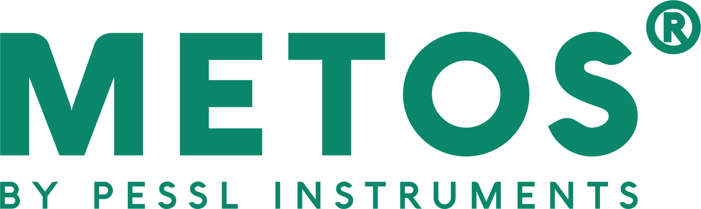
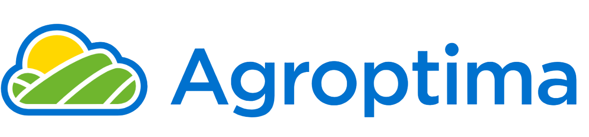
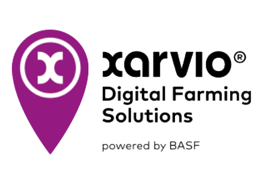
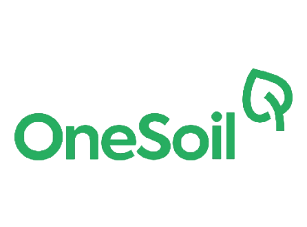
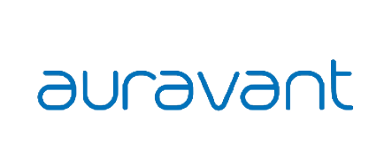

## Capítulo II: Requirements Elicitation & Analysis

### 2.1. Competidores.

<table style="width:100%; border-collapse:collapse; border:2px solid #000; font-family:Arial, sans-serif; table-layout:fixed;">
  <thead>
    <tr>
      <th style="background:#a11d2f; color:#fff; padding:12px; border:1px solid #000; text-align:center; width:15%;">Tipo</th>
      <th style="background:#a11d2f; color:#fff; padding:12px; border:1px solid #000; text-align:center; width:18%;">Competidor</th>
      <th style="background:#a11d2f; color:#fff; padding:12px; border:1px solid #000; text-align:center; width:28%;">Descripción</th>
      <th style="background:#a11d2f; color:#fff; padding:12px; border:1px solid #000; text-align:center; width:28%;">Características</th>
      <th style="background:#a11d2f; color:#fff; padding:12px; border:1px solid #000; text-align:center; width:16%;">Website</th>
    </tr>
  </thead>
  <tbody>
    <tr style="page-break-inside:avoid; break-inside:avoid;">
      <td style="background:#dfeeda; font-weight:700; text-align:center; border:1px solid #000; vertical-align:middle; height:140px;">
        Directo
      </td>
      <td style="border:1px solid #000; vertical-align:middle; padding:10px; height:140px;">
        
      </td>
      <td style="border:1px solid #000; vertical-align:top; padding:10px; height:140px; line-height:1.4;">
        Plataforma global que integra datos de sensores de suelo y clima (IoT) con modelos matemáticos predictivos de enfermedades.
      </td>
      <td style="border:1px solid #000; vertical-align:top; padding:10px; height:140px; line-height:1.4;">
        <ul style="margin:0; padding-left:18px;">
          <li>Integración directa con hardware propio (estaciones meteorológicas)</li>
          <li>Modelos de enfermedades para múltiples cultivos</li>
          <li>Pronóstico hiperlocal.</li>
        </ul>
      </td>
      <td style="border:1px solid #000; vertical-align:middle; padding:10px; height:140px;text-align:center;">
        <a href="https://metos.global/es/"style="color:#0b57d0; text-decoration:underline;" target="_blank">
      metos.global
      </td>
    </tr>
    <!-- siguiente fila -->
    <tr style="page-break-inside:avoid; break-inside:avoid;">
      <td style="background:#dfeeda; font-weight:700; text-align:center; border:1px solid #000; vertical-align:middle; height:140px;">
        Directo
      </td>
      <td style="border:1px solid #000; vertical-align:middle; padding:10px; height:140px;">
        
      </td>
      <td style="border:1px solid #000; vertical-align:top; padding:10px; height:140px; line-height:1.4;">
        Software de gestión agrícola muy popular en España y LATAM, fuertemente utilizado en el sector olivarero para la trazabilidad.
      </td>
      <td style="border:1px solid #000; vertical-align:top; padding:10px; height:140px; line-height:1.4;">
        <ul style="margin:0; padding-left:18px;">
          <li>Cuaderno de campo digital</li>
          <li>Registro geolocalizado de aplicación de fitosanitarios</li>
          <li>Control de costos</li>
          <li>App funcional en modo offline</li>
        </ul>
      </td>
      <td style="border:1px solid #000; vertical-align:middle; padding:10px; height:140px;text-align:center;">
        <a href="https://www.agroptima.com"style="color:#0b57d0; text-decoration:underline;" target="_blank">
      agroptima.com
      </td>
    </tr>
    <!-- siguiente fila -->
    <tr style="page-break-inside:avoid; break-inside:avoid;">
      <td style="background:#dfeeda; font-weight:700; text-align:center; border:1px solid #000; vertical-align:middle; height:140px;">
        Directo
      </td>
      <td style="border:1px solid #000; vertical-align:middle; padding:10px; height:140px;">
        
      </td>
      <td style="border:1px solid #000; vertical-align:top; padding:10px; height:140px; line-height:1.4;">
        Plataforma de agricultura digital de BASF especializada en modelos de riesgo de enfermedades y apoyo a decisiones fitosanitarias.
      </td>
      <td style="border:1px solid #000; vertical-align:top; padding:10px; height:140px; line-height:1.4;">
        <ul style="margin:0; padding-left:18px;">
          <li>Mapas de riesgo sanitario en tiempo real</li>
          <li>Alertas de protección de cultivos</li>
          <li>Recomendaciones precisas de fungicidas e insecticidas.</li>        
        </ul>
      </td>
      <td style="border:1px solid #000; vertical-align:middle; padding:10px; height:140px;text-align:center;">
        <a href="https://www.xarvio.com"style="color:#0b57d0; text-decoration:underline;" target="_blank">
      xarvio.com
      </td>
    </tr>
     <!-- siguiente fila (indirecto) -->
    <tr style="page-break-inside:avoid; break-inside:avoid;">
      <td style="background:#f7e1c9; font-weight:700; text-align:center; border:1px solid #000; vertical-align:middle; height:140px;">
        Indirecto
      </td>
      <td style="border:1px solid #000; vertical-align:middle; padding:10px; height:140px;">
        
      </td>
      <td style="border:1px solid #000; vertical-align:top; padding:10px; height:140px; line-height:1.4;">
        Aplicación gratuita de agricultura de precisión basada en el análisis de imágenes satelitales e índices de vegetación.
      </td>
      <td style="border:1px solid #000; vertical-align:top; padding:10px; height:140px; line-height:1.4;">
        <ul style="margin:0; padding-left:18px;">
          <li>Monitoreo remoto del vigor del cultivo (NDVI)</li>
          <li>Notas de campo (scouting) geolocalizadas</li>
          <li>Pronóstico del clima.</li>
        </ul>
      </td>
      <td style="border:1px solid #000; vertical-align:middle; padding:10px; height:140px;text-align:center;">
        <a href="https://onesoil.ai"style="color:#0b57d0; text-decoration:underline;" target="_blank">
      onesoil.com
      </td>
    </tr>
     <!-- siguiente fila (indirecto) -->
    <tr style="page-break-inside:avoid; break-inside:avoid;">
      <td style="background:#f7e1c9; font-weight:700; text-align:center; border:1px solid #000; vertical-align:middle; height:140px;">
        Indirecto
      </td>
      <td style="border:1px solid #000; vertical-align:middle; padding:10px; height:140px;">
        
      </td>
      <td style="border:1px solid #000; vertical-align:top; padding:10px; height:140px; line-height:1.4;">
        Plataforma "todo en uno" para agricultura digital enfocada en agrónomos y empresas tecnificadas, con fuerte presencia en LATAM.
      </td>
      <td style="border:1px solid #000; vertical-align:top; padding:10px; height:140px; line-height:1.4;">
        <ul style="margin:0; padding-left:18px;">
          <li>Creación de zonas de manejo</li>
          <li>Prescripciones de insumos variables</li>
          <li>Análisis de capas de información (suelo, clima, rendimiento).</li>
        </ul>
      </td>
      <td style="border:1px solid #000; vertical-align:middle; padding:10px; height:140px;text-align:center;">
        <a href="https://www.auravant.com"style="color:#0b57d0; text-decoration:underline;" target="_blank">
      auravant.com
      </td>
    </tr>
     <!-- siguiente fila (indirecto) -->
    <tr style="page-break-inside:avoid; break-inside:avoid;">
      <td style="background:#f7e1c9; font-weight:700; text-align:center; border:1px solid #000; vertical-align:middle; height:140px;">
        Indirecto
      </td>
      <td style="border:1px solid #000; vertical-align:middle; padding:10px; height:140px;">
        
      </td>
      <td style="border:1px solid #000; vertical-align:top; padding:10px; height:140px; line-height:1.4;">
        Sistema público oficial del Estado Peruano encargado de monitorear, alertar y contener plagas cuarentenarias (ej. Xylella fastidiosa).
      </td>
      <td style="border:1px solid #000; vertical-align:top; padding:10px; height:140px; line-height:1.4;">
        <ul style="margin:0; padding-left:18px;">
          <li>Emisión de alertas epidemiológicas regionales</li>
          <li>Normativas de control oficial</li>
          <li>Red de inspectores en campo</li>
          <li>Acceso gratuito pero no personalizado.</li>
        </ul>
      </td>
      <td style="border:1px solid #000; vertical-align:middle; padding:10px; height:140px;text-align:center;">
        <a href="https://www.gob.pe/senasa"style="color:#0b57d0; text-decoration:underline;" target="_blank">
      gob.pe/senasa
      </td>
    </tr>
    </tr>
  </tbody>
</table>

#### 2.1.1 Análisis competitivo

Análisis competitivo para competidores **directos**

<table style="width:100%; border-collapse:collapse; table-layout:fixed; font-family:Arial, sans-serif;">
  <colgroup>
    <col style="width:18%;">
    <col style="width:14%;">
    <col style="width:17%;">  <!-- Col 3: Viora -->
    <col style="width:17%;">  <!-- Col 4: Metos -->
    <col style="width:17%;">  <!-- Col 5: Agroptima -->
    <col style="width:17%;">  <!-- Col 6: Xarvio -->
  </colgroup>
  <tr>
    <th colspan="6" style="background:#a11d2f; color:#fff; padding:12px; border:1px solid #000; text-align:center; font-size:18px;">
      Competitive Analysis Landscape
    </th>
  </tr>
  <tr>
    <td rowspan="2" style="border:1px solid #000; padding:12px; font-weight:700; vertical-align:middle;">
      ¿Por qué llevar a cabo este análisis?
    </td>
    <td colspan="5" style="border:1px solid #000; padding:12px; vertical-align:top;">
      Escriba en el recuadro la pregunta que busca responder o el objetivo de este análisis.
    </td>
  </tr>
  <tr>
    <td colspan="5" style="border:1px solid #000; padding:12px; font-style:italic; vertical-align:top;">
      ¿Qué soluciones AgTech de gestión y prevención de plagas existen a nivel global, y cómo Viora puede penetrar en el mercado sur peruano aprovechando las barreras de entrada (como altos costos de hardware o falta de enfoque local) de los líderes internacionales?
    </td>
  </tr>
  <tr>
    <td colspan="2" style="background:#d9d9d9; border:1px solid #000; padding:12px; font-weight:700; vertical-align:middle; text-align:center;">
      Competidores
    </td>
    <!-- Viora -->
    <td style="background:#014b18; border:1px solid #000; padding:12px; text-align:center; vertical-align:middle;">
      
    </td>
    <!-- Metos -->
    <td style="background:#d9d9d9; border:1px solid #000; padding:12px; text-align:center; vertical-align:middle;">
      
    </td>
    <!-- Agroptima -->
    <td style="background:#d9d9d9; border:1px solid #000; padding:12px; text-align:center; vertical-align:middle;">
      
    </td>
    <!-- Xarvio -->
    <td style="background:#d9d9d9; border:1px solid #000; padding:12px; text-align:center; vertical-align:middle;">
      
    </td>
  </tr>
  <tr style="page-break-inside:avoid; break-inside:avoid;">
    <td rowspan="2" style="border:1px solid #000; padding:12px; font-weight:700; vertical-align:middle; text-align:center;">
      PERFIL
    </td>
    <td style="border:1px solid #000; padding:12px; font-weight:700; vertical-align:top;">
      Overview
    </td>
    <td style="border:1px solid #000; padding:12px; vertical-align:top;">
      Plataforma SaaS B2B hiper-especializada en el ciclo de producción del olivo, que integra datos ambientales para emitir alertas y conecta a productores con agrónomos.
    </td>
    <td style="border:1px solid #000; padding:12px; vertical-align:top;">
      Plataforma global que integra hardware IoT (estaciones meteorológicas) con software predictivo de enfermedades (FieldClimate).
    </td>
    <td style="border:1px solid #000; padding:12px; vertical-align:top;">
      Software líder de gestión agrícola enfocado en el cuaderno de campo, trazabilidad de operaciones y control de costos.
    </td>
    <td style="border:1px solid #000; padding:12px; vertical-align:top;">
      Plataforma de agricultura digital de BASF especializada en modelos de riesgo sanitario y apoyo a decisiones fitosanitarias.
    </td>
  </tr>
  <tr style="page-break-inside:avoid; break-inside:avoid;">
    <td style="border:1px solid #000; padding:12px; font-weight:700; vertical-align:top;">
      Ventaja competitiva ¿Qué valor ofrece al cliente?
    </td>
    <td style="border:1px solid #000; padding:12px; vertical-align:top;">
      Alertas predictivas hiper-locales exclusivas para la fenología del olivo y un marketplace integrado para contratar la solución inmediata.
    </td>
    <td style="border:1px solid #000; padding:12px; vertical-align:top;">
      Precisión extrema al basar sus predicciones en datos extraídos por sus propios sensores físicos instalados en la parcela del cliente.
    </td>
    <td style="border:1px solid #000; padding:12px; vertical-align:top;">
      Usabilidad superior para el agricultor en el campo (funciona 100% offline) y simplificación del cumplimiento legal.
    </td>
    <td style="border:1px solid #000; padding:12px; vertical-align:top;">
      Algoritmos respaldados por años de I+D de BASF, con alta precisión en la recomendación del momento exacto para aplicar fungicidas.
    </td>
  </tr>
<!--Perfil de marketing-->
<tr style="page-break-inside:avoid; break-inside:avoid;">
    <td rowspan="2" style="border:1px solid #000; padding:12px; font-weight:700; vertical-align:middle; text-align:center;">
      PERFIL DE MARKETING
    </td>
    <td style="border:1px solid #000; padding:12px; font-weight:700; vertical-align:top;">
      Mercado Objetivo
    </td>
    <td style="border:1px solid #000; padding:12px; vertical-align:top;">
      Pequeños/medianos productores de olivo y especialistas técnicos en sanidad agrícola del sur del Perú (ej. Tacna).
    </td>
    <td style="border:1px solid #000; padding:12px; vertical-align:top;">
      Grandes corporaciones agroindustriales y fundos de cultivos de alto valor que pueden permitirse invertir en infraestructura (hardware).
    </td>
    <td style="border:1px solid #000; padding:12px; vertical-align:top;">
      Agricultores profesionales, cooperativas y gerentes de fundos de todos los tamaños, principalmente en España y LATAM.
    </td>
    <td style="border:1px solid #000; padding:12px; vertical-align:top;">
      Productores agrícolas que buscan optimizar su inversión en agroquímicos y proteger el rendimiento de sus cultivos intensivos/extensivos.
    </td>
  </tr>
  <tr style="page-break-inside:avoid; break-inside:avoid;">
    <td style="border:1px solid #000; padding:12px; font-weight:700; vertical-align:top;">
      Estrategias de Marketing
    </td>
    <td style="border:1px solid #000; padding:12px; vertical-align:top;">
      Growth Loop basado en referidos/afiliados, alianzas estratégicas con cooperativas locales y asociaciones de productores.
    </td>
    <td style="border:1px solid #000; padding:12px; vertical-align:top;">
      Venta consultiva corporativa B2B y asociaciones con distribuidores locales de maquinaria y hardware agrícola.
    </td>
    <td style="border:1px solid #000; padding:12px; vertical-align:top;">
      Fuerte Content Marketing, prueba gratuita (Trial) de 15 días, embajadores de marca y presencia en ferias agrícolas.
    </td>
    <td style="border:1px solid #000; padding:12px; vertical-align:top;">
      Inbound Marketing, Product-Led Growth (versión freemium) e integraciones con productos químicos de su empresa matriz (BASF).
    </td>
  </tr>
<!--PERFIL DE PRODUCTO-->
<tr style="page-break-inside:avoid; break-inside:avoid;">
    <td rowspan="3" style="border:1px solid #000; padding:12px; font-weight:700; vertical-align:middle; text-align:center;">
      PERFIL DE PRODUCTO
    </td>
    <td style="border:1px solid #000; padding:12px; font-weight:700; vertical-align:top;">
      Productos & Servicios
    </td>
    <td style="border:1px solid #000; padding:12px; vertical-align:top;">
      <ul style="margin:0; padding-left:18px;">
          <li>Dashboard de finca.</li>
          <li>motor predictivo de vecería/clima.</li>
          <li>sistema de alertas fitosanitarias tempranas.</li>
          <li>directorio de especialistas.</li>
      </ul>
    </td>
    <td style="border:1px solid #000; padding:12px; vertical-align:top;">
      <ul style="margin:0; padding-left:18px;">
          <li>Venta/alquiler de estaciones meteorológicas físicas.</li>
          <li>app FieldClimate, y suscripciones a modelos matemáticos de enfermedades.</li>
      </ul>
    </td>
    <td style="border:1px solid #000; padding:12px; vertical-align:top;">
      <ul style="margin:0; padding-left:18px;">
          <li>Cuaderno de campo digital.</li>
          <li>registro geolocalizado de actividades.</li>
          <li>reportes de costos.</li>
          <li>control de stock de fertilizantes.</li>
      </ul>
    </td>
    <td style="border:1px solid #000; padding:12px; vertical-align:top;">
      <ul style="margin:0; padding-left:18px;">
          <li>Mapas de riesgo de enfermedades en tiempo real.</li>
          <li>alertas de protección de cultivos y reconocimiento de malezas por imagenm.</li>
      </ul>
    </td>
  </tr>
  <tr style="page-break-inside:avoid; break-inside:avoid;">
    <td style="border:1px solid #000; padding:12px; font-weight:700; vertical-align:top;">
      Precios & Costos
    </td>
    <td style="border:1px solid #000; padding:12px; vertical-align:top;">
      Modelo SaaS puro (Suscripciones mensuales/anuales escalonadas) con periodo de prueba de riesgo cero.
    </td>
    <td style="border:1px solid #000; padding:12px; vertical-align:top;">
      Alto costo de entrada (compra de equipos físicos) + suscripción anual por el acceso al software y a los modelos de enfermedades.
    </td>
    <td style="border:1px solid #000; padding:12px; vertical-align:top;">
      Modelo SaaS con suscripción anual basada en módulos según el tamaño de la explotación agrícola.
    </td>
    <td style="border:1px solid #000; padding:12px; vertical-align:top;">
      Modelo Freemium; funciones básicas gratuitas y versiones PRO/Premium de pago anual.
    </td>
  </tr>
  <!--Nueva Fila-->
  <tr style="page-break-inside:avoid; break-inside:avoid;">
    <td style="border:1px solid #000; padding:12px; font-weight:700; vertical-align:top;">
      Canales de distribución
    </td>
    <td style="border:1px solid #000; padding:12px; vertical-align:top;">
      Web Application responsiva y Landing Page orientada a conversión.
    </td>
    <td style="border:1px solid #000; padding:12px; vertical-align:top;">
      Red de distribuidores físicos exclusivos, Web Application y App Móvil.
    </td>
    <td style="border:1px solid #000; padding:12px; vertical-align:top;">
      Web Application y App Móvil nativa (iOS y Android).
    </td>
    <td style="border:1px solid #000; padding:12px; vertical-align:top;">
      Web Application y App Móvil nativa (iOS y Android).
    </td>
  </tr>
  <!--ANÁLISIS SWOT-->
<tr style="page-break-inside:avoid; break-inside:avoid;">
    <td rowspan="4" style="border:1px solid #000; padding:12px; font-weight:700; vertical-align:middle; text-align:center;">
      ANÁLISIS SWOT
    </td>
    <td style="border:1px solid #000; padding:12px; font-weight:700; vertical-align:top;">
      Fortalezas
    </td>
    <td style="border:1px solid #000; padding:12px; vertical-align:top;">
      <ul style="margin:0; padding-left:18px;">
          <li>Especialización total en el ecosistema del olivo.</li>
          <li>Resuelve el problema completo conectando la alerta con el técnico que la soluciona.</li>
      </ul>
    </td>
    <td style="border:1px solid #000; padding:12px; vertical-align:top;">
      <ul style="margin:0; padding-left:18px;">
          <li>Datos hiper-precisos y reales de la parcela (no dependen de proyecciones satelitales).</li>
          <li>Modelos de enfermedades muy maduros.</li>
      </ul>
    </td>
    <td style="border:1px solid #000; padding:12px; vertical-align:top;">
      <ul style="margin:0; padding-left:18px;">
          <li>Interfaz a prueba de fallos (modo offline vital para zonas rurales).</li>
          <li>Liderazgo en el registro de costos operativos.</li>
      </ul>
    </td>
    <td style="border:1px solid #000; padding:12px; vertical-align:top;">
      <ul style="margin:0; padding-left:18px;">
          <li>Fuerte respaldo corporativo internacional.</li>
          <li>Modelos predictivos altamente entrenados con millones de datos.</li>
      </ul>
    </td>
  </tr>
  <tr style="page-break-inside:avoid; break-inside:avoid;">
    <td style="border:1px solid #000; padding:12px; font-weight:700; vertical-align:top;">
      Debilidades
    </td>
    <td style="border:1px solid #000; padding:12px; vertical-align:top;">
      <ul style="margin:0; padding-left:18px;">
          <li>No posee hardware físico propio.</li>
          <li>Depende de APIs de terceros para el clima y de la conectividad en la zona.</li>
      </ul>
    </td>
    <td style="border:1px solid #000; padding:12px; vertical-align:top;">
      <ul style="margin:0; padding-left:18px;">
          <li>Costo inaccesible para el pequeño agricultor.</li>
          <li>El hardware requiere mantenimiento físico periódico.</li>
      </ul>
    </td>
    <td style="border:1px solid #000; padding:12px; vertical-align:top;">
      <ul style="margin:0; padding-left:18px;">
          <li>Es un software de gestión (ERP), no un sistema especializado en alertas tempranas predictivas de plagas.</li>
      </ul>
    </td>
    <td style="border:1px solid #000; padding:12px; vertical-align:top;">
      <ul style="margin:0; padding-left:18px;">
          <li>Sus modelos pueden no estar finamente calibrados para microclimas extremos y específicos como la cabecera del desierto de Atacama.</li>
      </ul>
    </td>
  </tr>
  <!--Nueva Fila-->
  <tr style="page-break-inside:avoid; break-inside:avoid;">
    <td style="border:1px solid #000; padding:12px; font-weight:700; vertical-align:top;">
      Oportunidades
    </td>
    <td style="border:1px solid #000; padding:12px; vertical-align:top;">
      <ul style="margin:0; padding-left:18px;">
          <li>Capturar a la gran masa de agricultores que no pueden pagar el hardware de METOS ni licencias de ERPs europeos.</li>
      </ul>
    </td>
    <td style="border:1px solid #000; padding:12px; vertical-align:top;">
      <ul style="margin:0; padding-left:18px;">
          <li>Integrar sus APIs con startups locales (SaaS) para vender el acceso a sus datos climáticos.</li>
      </ul>
    </td>
    <td style="border:1px solid #000; padding:12px; vertical-align:top;">
      <ul style="margin:0; padding-left:18px;">
          <li>Desarrollar sus propios módulos predictivos de plagas para complementar su cuaderno de campo.</li>
      </ul>
    </td>
    <td style="border:1px solid #000; padding:12px; vertical-align:top;">
      <ul style="margin:0; padding-left:18px;">
          <li>Expandir y localizar sus modelos de IA para incluir cultivos regionales específicos y plagas endémicas peruanas.</li>
      </ul>
    </td>
  </tr>
  <!--Nueva Fila-->
  <tr style="page-break-inside:avoid; break-inside:avoid;">
    <td style="border:1px solid #000; padding:12px; font-weight:700; vertical-align:top;">
      Amenazas
    </td>
    <td style="border:1px solid #000; padding:12px; vertical-align:top;">
      <ul style="margin:0; padding-left:18px;">
          <li>Competidores gigantes desarrollando módulos específicos para el olivo o integrando marketplaces en sus sistemas.</li>
      </ul>
    </td>
    <td style="border:1px solid #000; padding:12px; vertical-align:top;">
      <ul style="margin:0; padding-left:18px;">
          <li>Vandalismo o robo de equipos en zonas rurales de LATAM.</li>
          <li>Llegada de hardware IoT chino de bajo costo.</li>
          <li>lorem ipsum.</li>
      </ul>
    </td>
    <td style="border:1px solid #000; padding:12px; vertical-align:top;">
      <ul style="margin:0; padding-left:18px;">
          <li>Aparición de soluciones locales más económicas y adaptadas a la normativa tributaria y agrícola específica de Perú.</li>
      </ul>
    </td>
    <td style="border:1px solid #000; padding:12px; vertical-align:top;">
      <ul style="margin:0; padding-left:18px;">
          <li>Desconfianza del agricultor al ser "juez y parte" (un software de una empresa química recomendando aplicar químicos).</li>
      </ul>
    </td>
  </tr>
</table>

Análisis competitivo para competidores **indirectos**

<table style="width:100%; border-collapse:collapse; table-layout:fixed; font-family:Arial, sans-serif;">
  <colgroup>
    <col style="width:18%;">
    <col style="width:14%;">
    <col style="width:17%;">  <!-- Col 3: Viora -->
    <col style="width:17%;">  <!-- Col 4: SENASA -->
    <col style="width:17%;">  <!-- Col 5: OneSoil -->
    <col style="width:17%;">  <!-- Col 6: Auravant -->
  </colgroup>
  <tr>
    <th colspan="6" style="background:#a11d2f; color:#fff; padding:12px; border:1px solid #000; text-align:center; font-size:18px;">
      Competitive Analysis Landscape
    </th>
  </tr>
  <tr>
    <td rowspan="2" style="border:1px solid #000; padding:12px; font-weight:700; vertical-align:middle;">
      ¿Por qué llevar a cabo este análisis?
    </td>
    <td colspan="5" style="border:1px solid #000; padding:12px; vertical-align:top;">
      Escriba en el recuadro la pregunta que busca responder o el objetivo de este análisis.
    </td>
  </tr>
  <tr>
    <td colspan="5" style="border:1px solid #000; padding:12px; font-style:italic; vertical-align:top;">
      ¿Qué alternativas públicas o plataformas satelitales globales utilizan actualmente los productores olivareros para informarse sobre su campo, y cómo Viora puede diferenciarse en la mitigación específica de riesgos fitosanitarios y climáticos en la región sur?
    </td>
  </tr>
  <tr>
    <td colspan="2" style="background:#d9d9d9; border:1px solid #000; padding:12px; font-weight:700; vertical-align:middle; text-align:center;">
      Competidores
    </td>
    <!-- Viora -->
    <td style="background:#014b18; border:1px solid #000; padding:12px; text-align:center; vertical-align:middle;">
      
    </td>
    <!-- SENASA -->
    <td style="background:#d9d9d9; border:1px solid #000; padding:12px; text-align:center; vertical-align:middle;">
      
    </td>
    <!-- OneSoil -->
    <td style="background:#d9d9d9; border:1px solid #000; padding:12px; text-align:center; vertical-align:middle;">
      
    </td>
    <!-- Auravant -->
    <td style="background:#d9d9d9; border:1px solid #000; padding:12px; text-align:center; vertical-align:middle;">
      
    </td>
  </tr>
  <tr style="page-break-inside:avoid; break-inside:avoid;">
    <td rowspan="2" style="border:1px solid #000; padding:12px; font-weight:700; vertical-align:middle; text-align:center;">
      PERFIL
    </td>
    <td style="border:1px solid #000; padding:12px; font-weight:700; vertical-align:top;">
      Overview
    </td>
    <td style="border:1px solid #000; padding:12px; vertical-align:top;">
      Plataforma SaaS B2B hiper-especializada en el ciclo de producción del olivo, que integra datos ambientales para emitir alertas tempranas y conecta a productores con agrónomos locales.
    </td>
    <td style="border:1px solid #000; padding:12px; vertical-align:top;">
      Sistema público oficial del Estado Peruano encargado de monitorear, alertar y ejecutar el control oficial de plagas cuarentenarias a nivel nacional.
    </td>
    <td style="border:1px solid #000; padding:12px; vertical-align:top;">
      App global gratuita de agricultura de precisión basada en el análisis automático de imágenes satelitales e índices de vegetación (NDVI).
    </td>
    <td style="border:1px solid #000; padding:12px; vertical-align:top;">
      Plataforma integral "todo en uno" para agricultura digital, diseñada para maximizar el rendimiento mediante zonificación y prescripciones variables.
    </td>
  </tr>
  <tr style="page-break-inside:avoid; break-inside:avoid;">
    <td style="border:1px solid #000; padding:12px; font-weight:700; vertical-align:top;">
      Ventaja competitiva ¿Qué valor ofrece al cliente?
    </td>
    <td style="border:1px solid #000; padding:12px; vertical-align:top;">
      Alertas predictivas hiper-locales específicas para la fenología del olivo y conexión directa e instantánea con un marketplace de especialistas agrícolas.
    </td>
    <td style="border:1px solid #000; padding:12px; vertical-align:top;">
      Autoridad normativa oficial, respaldo estatal e infraestructura física de respuesta ante emergencias nacionales (ej. Xylella fastidiosa).
    </td>
    <td style="border:1px solid #000; padding:12px; vertical-align:top;">
      Acceso masivo, gratuito y de usabilidad extremadamente simple a mapas de vigor (NDVI) satelitales actualizados constantemente.
    </td>
    <td style="border:1px solid #000; padding:12px; vertical-align:top;">
      Ecosistema robusto y altamente escalable con integraciones y algoritmos potentes para agrónomos y corporaciones agroindustriales.
    </td>
  </tr>
<!--Perfil de marketing-->
<tr style="page-break-inside:avoid; break-inside:avoid;">
    <td rowspan="2" style="border:1px solid #000; padding:12px; font-weight:700; vertical-align:middle; text-align:center;">
      PERFIL DE MARKETING
    </td>
    <td style="border:1px solid #000; padding:12px; font-weight:700; vertical-align:top;">
      Mercado Objetivo
    </td>
    <td style="border:1px solid #000; padding:12px; vertical-align:top;">
      Pequeños/medianos productores olivareros y especialistas técnicos en sanidad agrícola del sur del Perú (ej. Tacna).
    </td>
    <td style="border:1px solid #000; padding:12px; vertical-align:top;">
      Todo el sector agropecuario nacional (productores de todos los rubros, importadores y exportadores).
    </td>
    <td style="border:1px solid #000; padding:12px; vertical-align:top;">
      Agricultores y técnicos agrícolas de todo el mundo, orientada fuertemente a cultivos de áreas extensivas.
    </td>
    <td style="border:1px solid #000; padding:12px; vertical-align:top;">
      ngenieros agrónomos, asesores técnicos y grandes empresas de producción agrícola tecnificada (fuerte en LATAM).
    </td>
  </tr>
  <tr style="page-break-inside:avoid; break-inside:avoid;">
    <td style="border:1px solid #000; padding:12px; font-weight:700; vertical-align:top;">
      Estrategias de Marketing
    </td>
    <td style="border:1px solid #000; padding:12px; vertical-align:top;">
      Growth Loop basado en referidos/afiliados, alianzas estratégicas con cooperativas locales y juntas de usuarios de agua.
    </td>
    <td style="border:1px solid #000; padding:12px; vertical-align:top;">
      Difusión pública mediante resoluciones directorales, campañas de prensa del Estado, y capacitaciones en campo.
    </td>
    <td style="border:1px solid #000; padding:12px; vertical-align:top;">
      Crecimiento orgánico apalancado por su modelo 100% gratuito (PLG - Product-Led Growth), SEO y redes sociales.
    </td>
    <td style="border:1px solid #000; padding:12px; vertical-align:top;">
      Ventas B2B consultivas (Outbound), webinars especializados, certificaciones para agrónomos y casos de éxito corporativos.
    </td>
  </tr>
<!--PERFIL DE PRODUCTO-->
<tr style="page-break-inside:avoid; break-inside:avoid;">
    <td rowspan="3" style="border:1px solid #000; padding:12px; font-weight:700; vertical-align:middle; text-align:center;">
      PERFIL DE PRODUCTO
    </td>
    <td style="border:1px solid #000; padding:12px; font-weight:700; vertical-align:top;">
      Productos & Servicios
    </td>
    <td style="border:1px solid #000; padding:12px; vertical-align:top;">
      <ul style="margin:0; padding-left:18px;">
          <li>Dashboard de finca.</li>
          <li>Motor predictivo de vecería/clima.</li>
          <li>Sistema de alertas fitosanitarias tempranas.</li>
          <li>Directorio de especialistas.</li>
      </ul>
    </td>
    <td style="border:1px solid #000; padding:12px; vertical-align:top;">
      <ul style="margin:0; padding-left:18px;">
          <li>Alertas epidemiológicas regionales.</li>
          <li>Inspecciones físicas de campo.</li>
          <li>Emisión de certificados fitosanitarios y guías técnicas.</li>
      </ul>
    </td>
    <td style="border:1px solid #000; padding:12px; vertical-align:top;">
      <ul style="margin:0; padding-left:18px;">
          <li>Mapas de vigor del cultivo.</li>
          <li>Pronóstico del clima.</li>
          <li>Notas de campo (scouting) geolocalizadas.</li>
          <li>Análisis de parcelas. </li>
      </ul>
    </td>
    <td style="border:1px solid #000; padding:12px; vertical-align:top;">
      <ul style="margin:0; padding-left:18px;">
          <li>Mapas de productividad.</li>
          <li>Ambientación de parcelas.</li>
          <li>Pescripciones de insumos.</li>
          <li>Reportes avanzados e integraciones IoT.</li>
      </ul>
    </td>
  </tr>
  <tr style="page-break-inside:avoid; break-inside:avoid;">
    <td style="border:1px solid #000; padding:12px; font-weight:700; vertical-align:top;">
      Precios & Costos
    </td>
    <td style="border:1px solid #000; padding:12px; vertical-align:top;">
      Modelo SaaS (Suscripciones mensuales/anuales escalonadas) con periodo Trial y garantía de devolución.
    </td>
    <td style="border:1px solid #000; padding:12px; vertical-align:top;">
      Gratuito (servicio público financiado por el Estado), aunque ciertos certificados tienen tasas administrativas.
    </td>
    <td style="border:1px solid #000; padding:12px; vertical-align:top;">
      100% Gratuito para el usuario final (monetizan mediante la venta de datos agregados y macro a corporaciones).
    </td>
    <td style="border:1px solid #000; padding:12px; vertical-align:top;">
      Modelo Freemium con límites; planes premium cobrados mensualmente por cantidad de hectáreas analizadas.
    </td>
  </tr>
  <!--Nueva Fila-->
  <tr style="page-break-inside:avoid; break-inside:avoid;">
    <td style="border:1px solid #000; padding:12px; font-weight:700; vertical-align:top;">
      Canales de distribución
    </td>
    <td style="border:1px solid #000; padding:12px; vertical-align:top;">
      Web Application responsiva y Landing Page informativa.
    </td>
    <td style="border:1px solid #000; padding:12px; vertical-align:top;">
      Portal institucional (gob.pe), oficinas desconcentradas regionales y canales telefónicos.
    </td>
    <td style="border:1px solid #000; padding:12px; vertical-align:top;">
      Aplicación Móvil (Android/iOS) y Web Application.
    </td>
    <td style="border:1px solid #000; padding:12px; vertical-align:top;">
      Web Application (principal) y App Móvil de soporte para campo.
    </td>
  </tr>
  <!--ANÁLISIS SWOT-->
<tr style="page-break-inside:avoid; break-inside:avoid;">
    <td rowspan="4" style="border:1px solid #000; padding:12px; font-weight:700; vertical-align:middle; text-align:center;">
      ANÁLISIS SWOT
    </td>
    <td style="border:1px solid #000; padding:12px; font-weight:700; vertical-align:top;">
      Fortalezas
    </td>
    <td style="border:1px solid #000; padding:12px; vertical-align:top;">
      <ul style="margin:0; padding-left:18px;">
          <li>Hiper-especialización en la problemática del olivo (vecería, horas de frío).</li>
          <li>Resuelve el problema End-to-End al incluir el servicio del agrónomo.</li>
      </ul>
    </td>
    <td style="border:1px solid #000; padding:12px; vertical-align:top;">
      <ul style="margin:0; padding-left:18px;">
          <li>Poder coercitivo y legal para cuarentenas.</li>
          <li>Información oficial irrefutable.</li>
          <li>Alcance nacional gratuito.</li>
      </ul>
    </td>
    <td style="border:1px solid #000; padding:12px; vertical-align:top;">
      <ul style="margin:0; padding-left:18px;">
          <li>UX/UI impecable y curva de aprendizaje nula.</li>
          <li>Acceso inmediato a data satelital sin costo para el agricultor.</li>
      </ul>
    </td>
    <td style="border:1px solid #000; padding:12px; vertical-align:top;">
      <ul style="margin:0; padding-left:18px;">
          <li>Análisis de datos sumamente profundo y científico.</li>
          <li>Integración con maquinaria agrícola avanzada.</li>
      </ul>
    </td>
  </tr>
  <tr style="page-break-inside:avoid; break-inside:avoid;">
    <td style="border:1px solid #000; padding:12px; font-weight:700; vertical-align:top;">
      Debilidades
    </td>
    <td style="border:1px solid #000; padding:12px; vertical-align:top;">
      <ul style="margin:0; padding-left:18px;">
          <li>Startup nueva sin base de datos histórica propia.</li>
          <li>Dependencia de adopción de dos frentes (productor y especialista).</li>
      </ul>
    </td>
    <td style="border:1px solid #000; padding:12px; vertical-align:top;">
      <ul style="margin:0; padding-left:18px;">
          <li>Alertas regionales (no por parcela específica).</li>
          <li>Gestión burocrática y reactiva, no es un software de gestión diaria.</li>
      </ul>
    </td>
    <td style="border:1px solid #000; padding:12px; vertical-align:top;">
      <ul style="margin:0; padding-left:18px;">
          <li>El NDVI satelital es genérico; avisa que hay un problema, pero no te dice qué plaga exacta es hasta que vas al campo.</li>
      </ul>
    </td>
    <td style="border:1px solid #000; padding:12px; vertical-align:top;">
      <ul style="margin:0; padding-left:18px;">
          <li>Curva de aprendizaje alta.</li>
          <li>Interfaz compleja que abruma al pequeño productor (Overkill de features).</li>
      </ul>
    </td>
  </tr>
  <!--Nueva Fila-->
  <tr style="page-break-inside:avoid; break-inside:avoid;">
    <td style="border:1px solid #000; padding:12px; font-weight:700; vertical-align:top;">
      Oportunidades
    </td>
    <td style="border:1px solid #000; padding:12px; vertical-align:top;">
      <ul style="margin:0; padding-left:18px;">
          <li>Mercado olivarero altamente golpeado por ENOS buscando digitalizarse.</li>
          <li>Absorber la lentitud del Estado mediante alertas más rápidas.</li>
      </ul>
    </td>
    <td style="border:1px solid #000; padding:12px; vertical-align:top;">
      <ul style="margin:0; padding-left:18px;">
          <li>Colaborar con startups AgTech (como Viora) para masificar sus protocolos oficiales de contención.</li>
      </ul>
    </td>
    <td style="border:1px solid #000; padding:12px; vertical-align:top;">
      <ul style="margin:0; padding-left:18px;">
          <li>Implementar modelos de IA para detectar plagas específicas desde imágenes (aunque muy difícil satelitalmente).</li>
      </ul>
    </td>
    <td style="border:1px solid #000; padding:12px; vertical-align:top;">
      <ul style="margin:0; padding-left:18px;">
          <li>Expandir su alcance hacia cultivos intensivos de menor escala si simplifican su interfaz de usuario.</li>
      </ul>
    </td>
  </tr>
  <!--Nueva Fila-->
  <tr style="page-break-inside:avoid; break-inside:avoid;">
    <td style="border:1px solid #000; padding:12px; font-weight:700; vertical-align:top;">
      Amenazas
    </td>
    <td style="border:1px solid #000; padding:12px; vertical-align:top;">
      <ul style="margin:0; padding-left:18px;">
          <li>Resistencia al cambio tecnológico en la agricultura familiar.</li>
          <li>Limitaciones de conectividad a internet en zonas rurales.</li>
      </ul>
    </td>
    <td style="border:1px solid #000; padding:12px; vertical-align:top;">
      <ul style="margin:0; padding-left:18px;">
          <li>Recortes de presupuesto estatal que limiten su capacidad de monitoreo presencial ante nuevos brotes.</li>
      </ul>
    </td>
    <td style="border:1px solid #000; padding:12px; vertical-align:top;">
      <ul style="margin:0; padding-left:18px;">
          <li>AgTechs de nicho (como Viora) que ofrezcan un valor mucho más específico y localizado que un simple mapa de colores.</li>
      </ul>
    </td>
    <td style="border:1px solid #000; padding:12px; vertical-align:top;">
      <ul style="margin:0; padding-left:18px;">
          <li>Plataformas gratuitas (como OneSoil) que eduquen al usuario base y le quiten mercado en la base de la pirámide.</li>
      </ul>
    </td>
  </tr>
</table>

#### 2.1.2 Estrategias y tácticas frente a competidores

<table style="width:100%; border-collapse:collapse; table-layout:fixed; font-family:Arial, sans-serif;">
  <colgroup>
    <col style="width:18%;">
    <col style="width:27%;">
    <col style="width:27%;">
    <col style="width:28%;">
  </colgroup>
  <tr>
    <th style="background:#d9d9d9; border:1px solid #000; padding:12px; text-align:left;">
      Competidor
    </th>
    <th style="background:#d9d9d9; border:1px solid #000; padding:12px; text-align:left;">
      Táctica diferenciadora
    </th>
    <th style="background:#d9d9d9; border:1px solid #000; padding:12px; text-align:left;">
      Fortaleza del rival que enfrentamos
    </th>
    <th style="background:#d9d9d9; border:1px solid #000; padding:12px; text-align:left;">
      Debilidad del rival que aprovechamos
    </th>
  </tr>
  <!-- FILA 1 -->
  <tr style="page-break-inside:avoid; break-inside:avoid;">
    <td style="border:1px solid #000; padding:12px; vertical-align:middle; text-align:center;">
      
    </td>
    <td style="border:1px solid #000; padding:12px; vertical-align:top; line-height:1.4;">
      <b>"lorem ipsum":</b> Lorem ipsum dolor sit amet, consectetur adipiscing elit, sed do eiusmod tempor incididunt ut labore et dolore magna aliqua.
    </td>
    <td style="border:1px solid #000; padding:12px; vertical-align:top; line-height:1.4;">
      <b>"lorem ipsum":</b> Lorem ipsum dolor sit amet, consectetur adipiscing elit, sed do eiusmod tempor incididunt ut labore et dolore magna aliqua.
    </td>
    <td style="border:1px solid #000; padding:12px; vertical-align:top; line-height:1.4;">
      <b>"lorem ipsum":</b> Lorem ipsum dolor sit amet, consectetur adipiscing elit, sed do eiusmod tempor incididunt ut labore et dolore magna aliqua.
    </td>
  </tr>
  <!-- FILA 2 -->
  <tr style="page-break-inside:avoid; break-inside:avoid;">
    <td style="border:1px solid #000; padding:12px; vertical-align:middle; text-align:center;">
      
    </td>
    <td style="border:1px solid #000; padding:12px; vertical-align:top; line-height:1.4;">
      <b>"lorem ipsum":</b> Lorem ipsum dolor sit amet, consectetur adipiscing elit, sed do eiusmod tempor incididunt ut labore et dolore magna aliqua.
    </td>
    <td style="border:1px solid #000; padding:12px; vertical-align:top; line-height:1.4;">
      <b>"lorem ipsum":</b> Lorem ipsum dolor sit amet, consectetur adipiscing elit, sed do eiusmod tempor incididunt ut labore et dolore magna aliqua.
    </td>
    <td style="border:1px solid #000; padding:12px; vertical-align:top; line-height:1.4;">
      <b>"lorem ipsum":</b> Lorem ipsum dolor sit amet, consectetur adipiscing elit, sed do eiusmod tempor incididunt ut labore et dolore magna aliqua.
    </td>
  </tr>
  <!-- FILA 3 -->
  <tr style="page-break-inside:avoid; break-inside:avoid;">
    <td style="border:1px solid #000; padding:12px; vertical-align:middle; text-align:center;">
      
    </td>
    <td style="border:1px solid #000; padding:12px; vertical-align:top; line-height:1.4;">
      <b>"lorem ipsum":</b> Lorem ipsum dolor sit amet, consectetur adipiscing elit, sed do eiusmod tempor incididunt ut labore et dolore magna aliqua.
    </td>
    <td style="border:1px solid #000; padding:12px; vertical-align:top; line-height:1.4;">
      <b>"lorem ipsum":</b> Lorem ipsum dolor sit amet, consectetur adipiscing elit, sed do eiusmod tempor incididunt ut labore et dolore magna aliqua.
    </td>
    <td style="border:1px solid #000; padding:12px; vertical-align:top; line-height:1.4;">
      <b>"lorem ipsum":</b> Lorem ipsum dolor sit amet, consectetur adipiscing elit, sed do eiusmod tempor incididunt ut labore et dolore magna aliqua.
    </td>
  </tr>
</table>

  
<!--Matriz Foda y Came-->

<table style="width:100%; border-collapse:collapse; table-layout:fixed; font-family:Arial, sans-serif;">
  <colgroup>
    <col style="width:28%;">
    <col style="width:36%;">
    <col style="width:36%;">
  </colgroup>
  <!-- FILA 1 -->
  <tr style="page-break-inside:avoid; break-inside:avoid;">
    <td style="background:#2f8f2f; color:#fff; border:1px solid #000; padding:18px; text-align:center; vertical-align:middle;">
      

        Matriz F.O.D.A. y C.A.M.E.
      

      

      
    </td>
    <!-- Oportunidades -->
    <td style="background:#64c466; border:1px solid #000; padding:16px; vertical-align:top;">
      

        Oportunidades (O)
      

      

        <b>• lorem ipsum: </b>Lorem ipsum dolor sit amet, consectetur adipiscing elit, sed do eiusmod tempor incididunt ut labore et dolore magna aliqua. 
        <b>• lorem ipsum: </b>Lorem ipsum dolor sit amet, consectetur adipiscing elit, sed do eiusmod tempor incididunt ut labore et dolore magna aliqua. 
        <b>• lorem ipsum: </b>Lorem ipsum dolor sit amet, consectetur adipiscing elit, sed do eiusmod tempor incididunt ut labore et dolore magna aliqua. 
        <b>• lorem ipsum: </b>Lorem ipsum dolor sit amet, consectetur adipiscing elit, sed do eiusmod tempor incididunt ut labore et dolore magna aliqua. 
      

    </td>
    <!-- Amenazas -->
    <td style="background:#78a98a; border:1px solid #000; padding:16px; vertical-align:top;">
      

        Amenazas (A)
      

      

        b>• lorem ipsum: </b>Lorem ipsum dolor sit amet, consectetur adipiscing elit, sed do eiusmod tempor incididunt ut labore et dolore magna aliqua. 
        <b>• lorem ipsum: </b>Lorem ipsum dolor sit amet, consectetur adipiscing elit, sed do eiusmod tempor incididunt ut labore et dolore magna aliqua. 
        <b>• lorem ipsum: </b>Lorem ipsum dolor sit amet, consectetur adipiscing elit, sed do eiusmod tempor incididunt ut labore et dolore magna aliqua. 
      

    </td>
  </tr>
  <!-- FILA 2 -->
  <tr style="page-break-inside:avoid; break-inside:avoid;">
    <!-- Fortalezas -->
    <td style="background:#a7d68f; border:1px solid #000; padding:16px; vertical-align:top;">
      

        Fortalezas (F)
      

      

        <b>• lorem ipsum: </b>Lorem ipsum dolor sit amet, consectetur adipiscing elit, sed do eiusmod tempor incididunt ut labore et dolore magna aliqua. 
        <b>• lorem ipsum: </b>Lorem ipsum dolor sit amet, consectetur adipiscing elit, sed do eiusmod tempor incididunt ut labore et dolore magna aliqua. 
      

    </td>
    <!-- Estrategia Ofensiva -->
    <td style="background:#ffffff; border:1px solid #000; padding:16px; vertical-align:top;">
      

        Estrategia Ofensiva
      

      

        <b>FO1 – lorem ipsum:</b> Lorem ipsum dolor sit amet, consectetur adipiscing elit, sed do eiusmod tempor incididunt ut labore et dolore magna aliqua.  
        <b>FO2 – lorem ipsum:</b> Lorem ipsum dolor sit amet, consectetur adipiscing elit, sed do eiusmod tempor incididunt ut labore et dolore magna aliqua.  
        <b>FO3 – lorem ipsum:</b> Lorem ipsum dolor sit amet, consectetur adipiscing elit, sed do eiusmod tempor incididunt ut labore et dolore magna aliqua.  
      

    </td>
    <!-- Estrategia Defensiva -->
    <td style="background:#ffffff; border:1px solid #000; padding:16px; vertical-align:top;">
      

        Estrategia Defensiva
      

      

        <b>FA1 – lorem ipsum:</b> Lorem ipsum dolor sit amet, consectetur adipiscing elit, sed do eiusmod tempor incididunt ut labore et dolore magna aliqua.  
        <b>FA2 – lorem ipsum:</b> Lorem ipsum dolor sit amet, consectetur adipiscing elit, sed do eiusmod tempor incididunt ut labore et dolore magna aliqua.  
        <b>FA3 – lorem ipsum:</b> Lorem ipsum dolor sit amet, consectetur adipiscing elit, sed do eiusmod tempor incididunt ut labore et dolore magna aliqua.  
      

    </td>
  </tr>
  <!--Fila 3-->
  <tr style="page-break-inside:avoid; break-inside:avoid;">
    <!-- Debilidades -->
    <td style="background:#a7d68f; border:1px solid #000; padding:16px; vertical-align:top;">
      

        Debilidades (D)
      

      

        <b>• lorem ipsum: </b>Lorem ipsum dolor sit amet, consectetur adipiscing elit, sed do eiusmod tempor incididunt ut labore et dolore magna aliqua. 
        <b>• lorem ipsum: </b>Lorem ipsum dolor sit amet, consectetur adipiscing elit, sed do eiusmod tempor incididunt ut labore et dolore magna aliqua. 
      

    </td>
    <!-- Estrategia de Reorientación -->
    <td style="background:#ffffff; border:1px solid #000; padding:16px; vertical-align:top;">
      

        Estrategia de Reorientación
      

      

        <b>DO1 – lorem ipsum:</b> Lorem ipsum dolor sit amet, consectetur adipiscing elit, sed do eiusmod tempor incididunt ut labore et dolore magna aliqua.  
        <b>DO2 – lorem ipsum:</b> Lorem ipsum dolor sit amet, consectetur adipiscing elit, sed do eiusmod tempor incididunt ut labore et dolore magna aliqua.  
      

    </td>
    <!-- Estrategia de Supervivencia -->
    <td style="background:#ffffff; border:1px solid #000; padding:16px; vertical-align:top;">
      

        Estrategia de Supervivencia
      

      

        <b>DA1 – lorem ipsum:</b> Lorem ipsum dolor sit amet, consectetur adipiscing elit, sed do eiusmod tempor incididunt ut labore et dolore magna aliqua.  
        <b>DA2 – lorem ipsum:</b> Lorem ipsum dolor sit amet, consectetur adipiscing elit, sed do eiusmod tempor incididunt ut labore et dolore magna aliqua.  
      

    </td>
  </tr>
</table>

### 2.2. Entrevistas
#### 2.2.1. Diseño de entrevistas

**Entrevista: Productores Agropecuarios**  
**Objetivo:** Validar si ...

---

**1. Lorem ipsum**  
*Busca entender cómo ...*

- Lorem ipsum dolor sit amet, consectetur adipiscing elit, sed do eiusmod tempor incididunt ut labore et dolore magna aliqua.
- Lorem ipsum dolor sit amet, consectetur adipiscing elit, sed do eiusmod tempor incididunt ut labore et dolore magna aliqua.
- Lorem ipsum dolor sit amet, consectetur adipiscing elit, sed do eiusmod tempor incididunt ut labore et dolore magna aliqua.
- Lorem ipsum dolor sit amet, consectetur adipiscing elit, sed do eiusmod tempor incididunt ut labore et dolore magna aliqua.

---

**2. Lorem ipsum**

- Lorem ipsum dolor sit amet, consectetur adipiscing elit, sed do eiusmod tempor incididunt ut labore et dolore magna aliqua.
- Lorem ipsum dolor sit amet, consectetur adipiscing elit, sed do eiusmod tempor incididunt ut labore et dolore magna aliqua.
- Lorem ipsum dolor sit amet, consectetur adipiscing elit, sed do eiusmod tempor incididunt ut labore et dolore magna aliqua.
- Lorem ipsum dolor sit amet, consectetur adipiscing elit, sed do eiusmod tempor incididunt ut labore et dolore magna aliqua.

---

**3. Lorem ipsum**

- Lorem ipsum dolor sit amet, consectetur adipiscing elit, sed do eiusmod tempor incididunt ut labore et dolore magna aliqua.
- Lorem ipsum dolor sit amet, consectetur adipiscing elit, sed do eiusmod tempor incididunt ut labore et dolore magna aliqua.
- Lorem ipsum dolor sit amet, consectetur adipiscing elit, sed do eiusmod tempor incididunt ut labore et dolore magna aliqua.
- Lorem ipsum dolor sit amet, consectetur adipiscing elit, sed do eiusmod tempor incididunt ut labore et dolore magna aliqua.

---

**4. Usabilidad y Cierre**  
*Validación técnica y demográfica.*

- Lorem ipsum dolor sit amet, consectetur adipiscing elit, sed do eiusmod tempor incididunt ut labore et dolore magna aliqua.
- Lorem ipsum dolor sit amet, consectetur adipiscing elit, sed do eiusmod tempor incididunt ut labore et dolore magna aliqua.
- Lorem ipsum dolor sit amet, consectetur adipiscing elit, sed do eiusmod tempor incididunt ut labore et dolore magna aliqua.
    - Lorem ipsum dolor sit amet, consectetur adipiscing elit, sed do eiusmod tempor incididunt ut labore et dolore magna aliqua.

**Datos demográficos:**
- ¿Qué marca y modelo de celular utiliza actualmente?
- ¿Cuenta con computadora/laptop propia en casa o todo lo realiza desde el celular?
- Edad aproximada.
- Distrito/Región.
- Lorem ipsum.
- Lorem ipsum.

**Entrevista: Jóvenes y Estudiantes Rurales**  
**Objetivo:** Validar si el aprendizaje mediante simuladores (gamificación) reduce la brecha entre la “teoría aburrida” y la práctica real, y si lo ven como una herramienta para profesionalizar su futuro.

---

**1. Lorem ipsum**  
*Busca entender cómo ...*

- Lorem ipsum dolor sit amet, consectetur adipiscing elit, sed do eiusmod tempor incididunt ut labore et dolore magna aliqua.
- Lorem ipsum dolor sit amet, consectetur adipiscing elit, sed do eiusmod tempor incididunt ut labore et dolore magna aliqua.
- Lorem ipsum dolor sit amet, consectetur adipiscing elit, sed do eiusmod tempor incididunt ut labore et dolore magna aliqua.
- Lorem ipsum dolor sit amet, consectetur adipiscing elit, sed do eiusmod tempor incididunt ut labore et dolore magna aliqua.

---

**2. Lorem ipsum**

- Lorem ipsum dolor sit amet, consectetur adipiscing elit, sed do eiusmod tempor incididunt ut labore et dolore magna aliqua.
- Lorem ipsum dolor sit amet, consectetur adipiscing elit, sed do eiusmod tempor incididunt ut labore et dolore magna aliqua.
- Lorem ipsum dolor sit amet, consectetur adipiscing elit, sed do eiusmod tempor incididunt ut labore et dolore magna aliqua.
- Lorem ipsum dolor sit amet, consectetur adipiscing elit, sed do eiusmod tempor incididunt ut labore et dolore magna aliqua.

---

**3. Lorem ipsum**

- Lorem ipsum dolor sit amet, consectetur adipiscing elit, sed do eiusmod tempor incididunt ut labore et dolore magna aliqua.
- Lorem ipsum dolor sit amet, consectetur adipiscing elit, sed do eiusmod tempor incididunt ut labore et dolore magna aliqua.
- Lorem ipsum dolor sit amet, consectetur adipiscing elit, sed do eiusmod tempor incididunt ut labore et dolore magna aliqua.
- Lorem ipsum dolor sit amet, consectetur adipiscing elit, sed do eiusmod tempor incididunt ut labore et dolore magna aliqua.

---

**4. Lorem ipsum**  

- Lorem ipsum dolor sit amet, consectetur adipiscing elit, sed do eiusmod tempor incididunt ut labore et dolore magna aliqua.
- Lorem ipsum dolor sit amet, consectetur adipiscing elit, sed do eiusmod tempor incididunt ut labore et dolore magna aliqua.
- Lorem ipsum dolor sit amet, consectetur adipiscing elit, sed do eiusmod tempor incididunt ut labore et dolore magna aliqua.
    - Lorem ipsum dolor sit amet, consectetur adipiscing elit, sed do eiusmod tempor incididunt ut labore et dolore magna aliqua.

**5. Cierre y Datos Demográficos**  
*Para terminar, solo para clasificar tus respuestas:*

- ¿Qué marca y modelo de celular utiliza actualmente?
- ¿Cuentas con computadora/laptop propia en casa o todo lo realizas desde el celular?
- Edad.
- Nivel de estudios (Secundaria / Técnico / Universitario).
- ¿Tienes acceso a un smartphone propio?
- Distrito de residencia.

### 2.2.2. Registro de entrevistas

**Lorem ipsum**

<!------ ENTREVISTA (CUADRO) -------->
<table style="width:100%; border-collapse:collapse; font-family:Arial, sans-serif; table-layout:fixed;">
  <!-- titulo -->
  <tr>
    <th colspan="4" style="background:#9fd28f; border:1px solid #000; padding:10px; font-size:18px; text-align:center;">
      Entrevista #1
    </th>
  </tr>
  <!-- nombre completo -->
  <tr>
    <th style="background:#c9f2b8; border:1px solid #000; padding:10px; width:22%; text-align:center;">
      Nombre completo
    </th>
    <td colspan="3" style="border:1px solid #000; padding:10px;">
      Nombre del entrevistado
    </td>
  </tr>
  <!-- edad / distrito -->
  <tr>
    <th style="background:#c9f2b8; border:1px solid #000; padding:10px; text-align:center;">
      Edad
    </th>
    <td style="border:1px solid #000; padding:10px; width:28%;">
      10
    </td>
    <th style="background:#c9f2b8; border:1px solid #000; padding:10px; text-align:center; width:22%;">
      Distrito
    </th>
    <td style="border:1px solid #000; padding:10px;">
      Chorrillos, Lima
    </td>
  </tr>
  <!-- ocupación / inicio y duración -->
  <tr>
    <th style="background:#c9f2b8; border:1px solid #000; padding:10px; text-align:center;">
      Ocupación
    </th>
    <td style="border:1px solid #000; padding:10px;">
      Estudiante de Ingeniería de Software
    </td>
    <th style="background:#c9f2b8; border:1px solid #000; padding:10px; text-align:center;">
      Inicio y duración
    </th>
    <td style="border:1px solid #000; padding:10px;">
      00:00 - 10:00
    </td>
  </tr>
  <!-- enlace -->
  <tr>
    <th style="background:#c9f2b8; border:1px solid #000; padding:10px; text-align:center;">
      Enlace
    </th>
    <td colspan="3" style="border:1px solid #000; padding:10px; word-break:break-word;">
      <a href="https://youtu.be/GBIIQ0kP15E?si=nwPEx-2zvEbTdym3" target="_blank">
        Aqui pegas el link
      </a>
    </td>
  </tr>
  <!-- encabezado resumen / foto -->
  <tr>
    <th colspan="2" style="background:#9fd28f; border:1px solid #000; padding:10px; text-align:center;">
      Resumen
    </th>
    <th colspan="2" style="background:#9fd28f; border:1px solid #000; padding:10px; text-align:center;">
      Foto
    </th>
  </tr>
  <!-- contenido resumen / foto -->
  <tr style="page-break-inside:avoid; break-inside:avoid;">
    <!-- resumen -->
    <td colspan="2" style="border:1px solid #000; padding:12px; vertical-align:top; line-height:1.45; text-align:justify;">
      Aquí va el resumen de la entrevista
    </td>
    <!-- foto -->
    <td colspan="2" style="border:1px solid #000; padding:12px; vertical-align:top;">
      
    </td>
  </tr>
</table>