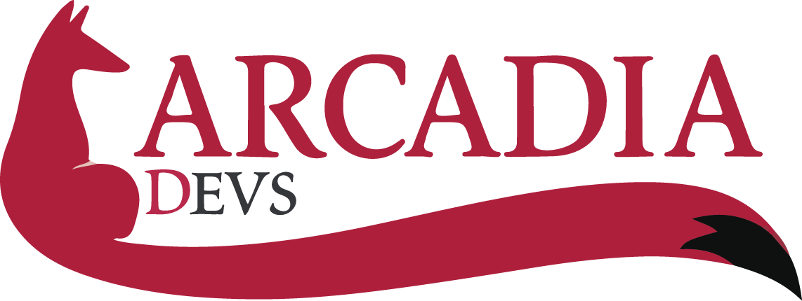
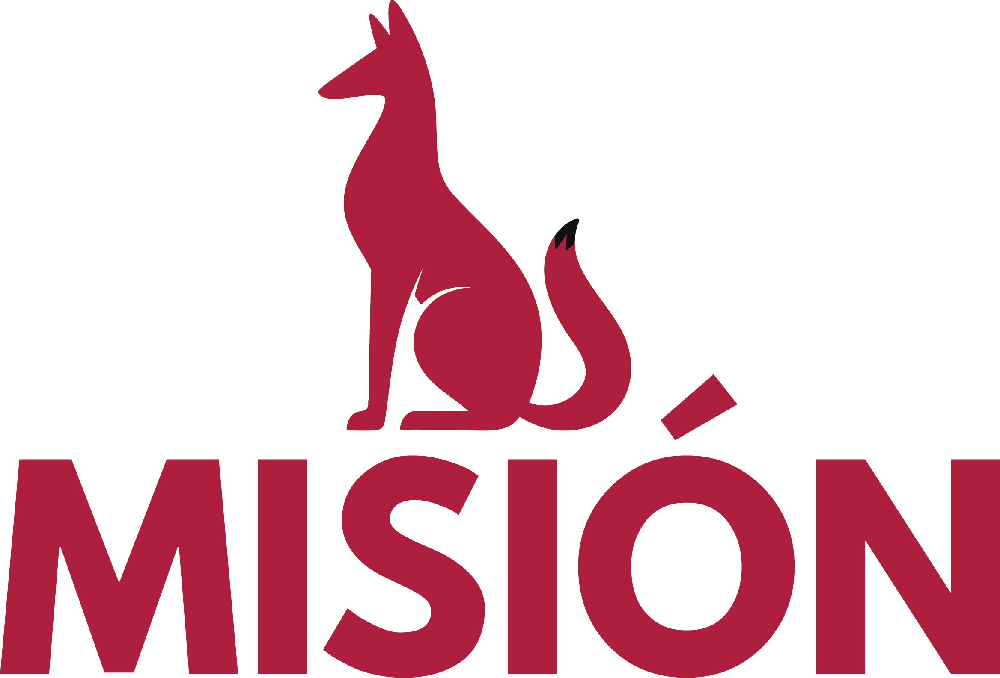
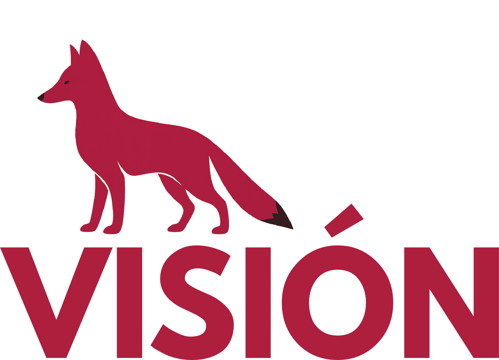
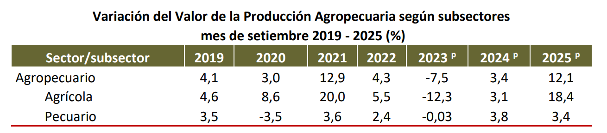
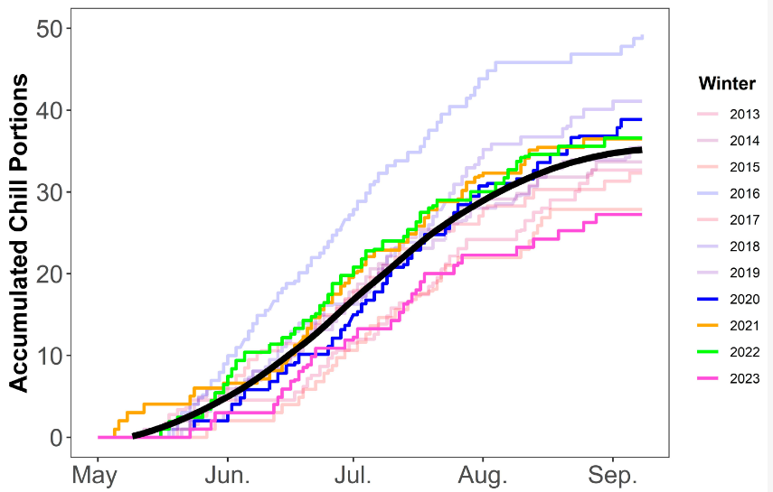
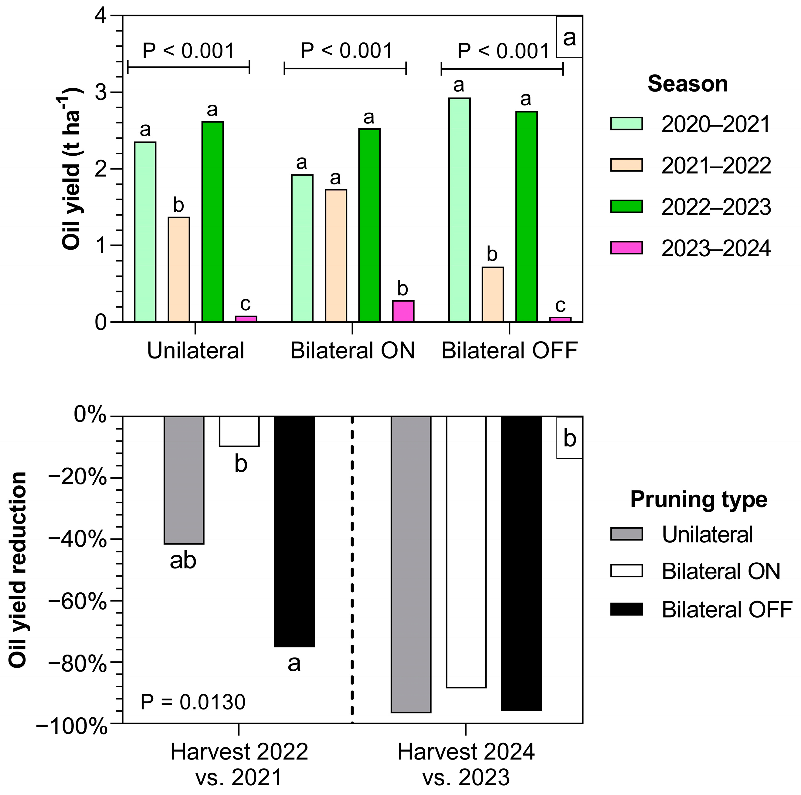
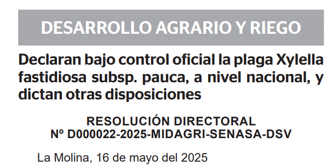
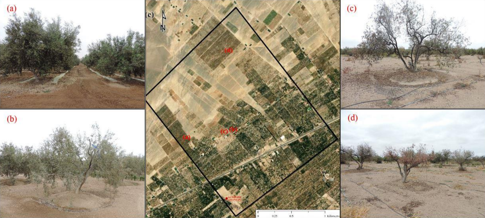
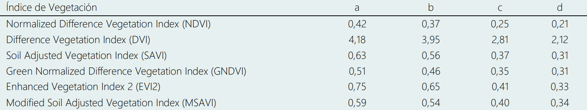

<strong>UNIVERSIDAD PERUANA DE CIENCIAS APLICADAS</strong> “Año de la Esperanza y el Fortalecimiento de la Democracia”

<h2><strong>DESARROLLO DE APLICACIONES OPEN SOURCE</strong></h2>
<h2><strong>AV1 INFORME DE TRABAJO</strong></h2>
  
  

<strong>CARRERA:</strong> Ingeniería de Software

<strong>CICLO:</strong> 2026 - 1

<strong>INTEGRANTES:</strong>

<table align="center">
  <tr><th>Alumnos</th><th>Código</th></tr>
  <tr><td>Espada Lazo, Piero Anthony</td><td>U20241d924</td></tr>
  <tr><td>Li Gayoso, Diana Carolina</td><td>U20245749</td></tr>
  <tr><td>Paredes Maza, Victor Juan de Dios</td><td>U202416274</td></tr>
  <tr><td>Santi Guerrero, Fabrizio Alonso</td><td>U202411774</td></tr>
  <tr><td>Trinidad Leon, Jahat Jassiel</td><td>U202412248</td></tr>
</table>

<strong>Sección:</strong>  10215

<strong>Docente:</strong>  Velasquez Nuñez, Angel Augusto

Campus Villa &nbsp;&nbsp;&nbsp;&nbsp;&nbsp;&nbsp;&nbsp;&nbsp;&nbsp; Lima - 2026-01

## Registro de Versiones del Informe

<table style="width: 100%; border-collapse: collapse; font-family: Arial, sans-serif;">
    <thead>
        <tr style="background-color: #f2f2f2; border-bottom: 2px solid #ddd;">
            <th style="padding: 12px; border: 1px solid #ddd; width: 10%; text-align: center; vertical-align: middle;">Versión</th>
            <th style="padding: 12px; border: 1px solid #ddd; width: 12%; text-align: center; vertical-align: middle;">Fecha</th>
            <th style="padding: 12px; border: 1px solid #ddd; width: 25%; text-align: center; vertical-align: middle;">Autores</th>
            <th style="padding: 12px; border: 1px solid #ddd; text-align: center; vertical-align: middle;">Descripción de Modificación</th>
        </tr>
    </thead>
    <tbody>
        <tr>
            <td rowspan="2" style="padding: 10px; border: 1px solid #ddd; text-align: center; vertical-align: middle; font-weight: bold; background-color: #fafafa;">
                TB1_V001
            </td>
            <td style="padding: 10px; border: 1px solid #ddd; vertical-align: middle;"></td>
            <td style="padding: 10px; border: 1px solid #ddd; vertical-align: middle;">
            </td>
            <td style="padding: 10px; border: 1px solid #ddd; vertical-align: middle; text-align: left;">
            </td>
        </tr>
        <tr>
            <td style="padding: 10px; border: 1px solid #ddd; vertical-align: middle;"></td>
            <td style="padding: 10px; border: 1px solid #ddd; vertical-align: middle;">
            </td>
            <td style="padding: 10px; border: 1px solid #ddd; vertical-align: middle; text-align: left;">
            </td>
        </tr>
    </tbody>
</table>

## Project Report Collaboration Insights

**Link del repositorio del informe:**

- https://github.com/ArcadiaDevsV/OS-NombreSolucion-Informe

**Link de los repositorios de la organización:**

-

## Contenido

  - [Registro de Versiones del Informe](#registro-de-versiones-del-informe)
  - [Project Report Collaboration Insights](#project-report-collaboration-insights)
  - [Contenido](#contenido)
  - [Student Outcome](#student-outcome)
  - [Capítulo I: Introducción](#capítulo-i-introducción)
    - [1.1 Startup Profile](#11-startup-profile)
      - [1.1.1 Descripción de la Startup](#111-descripción-de-la-startup)
    - [1.1.2 Perfiles de integrantes del equipo](#112-perfiles-de-integrantes-del-equipo)
    - [1.2 Solution Profile](#12-solution-profile)
      - [1.2.1 Antecedentes y problemática](#121-antecedentes-y-problemática)
      - [1.2.2 Lean UX Process](#122-lean-ux-process)
        - [1.2.2.1. Lean UX Problem Statements](#1221-lean-ux-problem-statements)
        - [1.2.2.2. Lean UX Assumptions](#1222-lean-ux-assumptions)
        - [1.2.2.3. Lean UX Hypothesis Statements](#1223-lean-ux-hypothesis-statements)
        - [1.2.2.4. Lean UX Canvas](#1224-lean-ux-canvas)
    - [1.3. Segmentos objetivo.](#13-segmentos-objetivo)
  - [Capítulo II: Requirements Elicitation & Analysis](#capítulo-ii-requirements-elicitation-analysis)
    - [2.1. Competidores.](#21-competidores)
      - [2.1.1 Análisis competitivo](#211-análisis-competitivo)
      - [2.1.2 Estrategias y tácticas frente a competidores](#212-estrategias-y-tácticas-frente-a-competidores)
    - [2.2. Entrevistas](#22-entrevistas)
      - [2.2.1. Diseño de entrevistas](#221-diseño-de-entrevistas)
    - [2.2.2. Registro de entrevistas](#222-registro-de-entrevistas)
  - [Bibliografía](#bibliografía)

## Student Outcome

| Criterio Específico                                                                               | Acciones Realizadas (TB1)                                                                                                                                                                                                                                                                                                                                                                                                                                                                                                             | Conclusiones (TB1)                                                                                                                                                                     |
| ------------------------------------------------------------------------------------------------- | ------------------------------------------------------------------------------------------------------------------------------------------------------------------------------------------------------------------------------------------------------------------------------------------------------------------------------------------------------------------------------------------------------------------------------------------------------------------------------------------------------------------------------------- | -------------------------------------------------------------------------------------------------------------------------------------------------------------------------------------- |
| **Comunica oralmente con efectividad a diferentes rangos de audiencia**                               | **Nombre Apellido 1 (U20XXXXXX)** • Coordinó la redacción del capítulo. • Organizó estructura del documento (índice, secciones, anclas). • Gestionó el repositorio (carpetas, assets, docs).  **Nombre Apellido 2 (U20XXXXXX)** • Definió lineamientos de contribución (commits, PR mínima). • Apoyó el armado de _Collaboration Insights_. • Revisó PRs y resolvió conflictos en `develop`.  **Nombre Apellido 3 (U20XXXXXX)** • Redactó problemática (5W+2H). • Normalizó terminología Lean UX. | La comunicación constante y la revisión cruzada de PRs aseguraron coherencia en TB1. El liderazgo compartido redujo retrabajos y permitió entregar una base sólida para avanzar a TP1. |
| **Comunica por escrito con efectividad a diferentes rangos de audiencia** |    

## Capítulo I: Introducción

### 1.1 Startup Profile

#### 1.1.1 Descripción de la Startup

  

    
  

Significado del nombre y del símbolo

**Arcadia** alude al ideal clásico de un lugar armónico donde las cosas “encajan” y fluyen; Devs refuerza nuestro ADN de ingeniería. Juntos, **ArcadiaDevs** expresa nuestra meta: crear productos tecnológicos ordenados y confiables, donde los datos trabajan a favor de cualquier comunidad.
En el logotipo, el zorro simboliza **ingenio y agilidad**; su cola en forma de trazo sugiere un **avance tecnológico** que conecta a los usuarios con las mejores soluciones de nuestra startup.

Quiénes somos

Somos un equipo de ingeniería y diseño que convierte datos complejos en decisiones simples y rentables para el sector agroindustrial. Actualmente impulsamos Viora, una plataforma SaaS B2B especializada en la gestión inteligente del ciclo de producción de aceitunas. Nuestro enfoque combina el monitoreo de variables de suelo y clima para emitir alertas epidemiológicas tempranas, brindando a los productores recomendaciones precisas y conectándolos directamente con profesionales especializados en sanidad agrícola.

<table style="width:100%; border-collapse:separate; border-spacing:0; background:#fbf0f2; border-radius:12px; margin:22px 0 14px 0;">
  <tr>
    <td style="width:140px; padding:18px 14px; vertical-align:middle; text-align:center;">
      
    </td>
    <td style="padding:18px 18px; vertical-align:middle;">
      

        <strong>Empoderar a los productores olivareros y especialistas agrícolas</strong> mediante una plataforma centralizada y basada en datos que optimice la toma de decisiones, prevenga plagas de forma temprana y maximice la calidad productiva y comercial de los cultivos.
      

    </td>
  </tr>
</table>

<table style="width:100%; border-collapse:separate; border-spacing:0; background:#fbf0f2; border-radius:12px; margin:0 0 18px 0;">
  <tr>
    <td style="width:140px; padding:18px 14px; vertical-align:middle; text-align:center;">
      
    </td>
    <td style="padding:18px 18px; vertical-align:middle;">
      

        Ser la <strong>plataforma AgTech de referencia en el sector olivarero</strong>, reconocida por integrar análisis de datos ambientales y redes de colaboración profesional para impulsar una agricultura más inteligente, predecible y altamente rentable.
      

    </td>
  </tr>
</table>

  

### 1.1.2 Perfiles de integrantes del equipo

<!-- PERFIL 1 -->
<table style="width:100%; table-layout:fixed; border-collapse:collapse; margin:16px 0 24px 0; border:1px solid #ddd; page-break-inside:avoid;">
  <tr>
    <td colspan="2" style="background:#a11d2f; color:#fff; font-weight:700; text-align:center; padding:10px 12px; letter-spacing:.3px;">
      CEO & Product Owner
    </td>
  </tr>
  <tr>
    <td style="padding:14px 16px; vertical-align:top;">
      
Victor Paredes Maza

      
(U202416274)

      

        Soy Victor Paredes Maza, tengo 18 años, estudio Ingeniería de Software en la Universidad Peruana de Ciencias Aplicadas y soy CEO de Viora. Elegí esta carrera porque me permite volver realidad grandes ideas. Lidero con visión estratégica, criterio, innovación, orden y enfoque en la calidad. Trabajo en equipo, escucho y ejecuto con disciplina. Busco mejorar cada día y alcanzar metas grandes, construyendo productos útiles y confiables.
      

    </td>
    <td style="width:220px; padding:14px 16px; vertical-align:top;">
      
    </td>
  </tr>
</table>

<!-- PERFIL 2 -->
<table style="width:100%; table-layout:fixed; border-collapse:collapse; margin:16px 0 24px 0; border:1px solid #ddd; page-break-inside:avoid;">
  <tr>
    <td colspan="2" style="background:#a11d2f; color:#fff; font-weight:700; text-align:center; padding:10px 12px; letter-spacing:.3px;">
      CPO & System Architect
    </td>
  </tr>
  <tr>
    <td style="padding:14px 16px; vertical-align:top;">
      
Santi Guerrero, Fabrizio Alonso

      
(U202411774)

      

        Soy Fabrizio Santi Guerrero, tengo 19 años, soy estudiante de la carrera de Ingeniería de Software en la Universidad Peruana de Ciencias Aplicadas y CPO de Viora. Soy desarrollador enfocado en el backend y arquitectura de software. A nivel técnico, tengo conocimientos de SQL, C++, Python, JavaScript, librerías de Ciencia de Datos y conocimientos Full-Stack. Entre mis fortalezas se puede encontrar la perseverancia, pleno esfuerzo y la disciplina.
        En ArcadiaDevs planificaré la arquitectura y estructura técnica del proyecto. También, colocaboraré con vigilar el flujo de coordinación del gurpo, y apoyar con respecto a la presentación e investigación de datos.
      

    </td>
    <td style="width:220px; padding:14px 16px; vertical-align:top;">
      
    </td>
  </tr>
</table>

<!-- PERFIL 3 -->
<table style="width:100%; table-layout:fixed; border-collapse:collapse; margin:16px 0 24px 0; border:1px solid #ddd; page-break-inside:avoid;">
  <tr>
    <td colspan="2" style="background:#a11d2f; color:#fff; font-weight:700; text-align:center; padding:10px 12px; letter-spacing:.3px;">
      CTO & Integrador DevOps
    </td>
  </tr>
  <tr>
    <td style="padding:14px 16px; vertical-align:top;">
      
Trinidad Leon, Jahat Jassiel

      
(U202412248)

      

        Soy Jahat Trinidad Leon, tengo 25 años, soy estudiante de la carrera de Ingeniería de Software en la Universidad Peruana de Ciencias Aplicadas y CTO de Viora. Soy desarrollador en formación con enfoque en DevOps y arquitectura de software. Manejo C++, Java y Python, además de SQL y diseño de bases de datos relacionales. Aplico GitFlow para control de versiones y GitHub Actions para CI/CD y despliegue automatizado.
        En ArcadiaDevs, lideraré la infraestructura de Viora: integración continua, automatización de despliegues y prototipado rápido. Complemento con conocimientos en diseño UI/UX para alinear la experiencia técnica con la visual del producto.
      

    </td>
    <td style="width:220px; padding:14px 16px; vertical-align:top;">
      
    </td>
  </tr>
</table>

<!-- PERFIL 4 -->
<table style="width:100%; table-layout:fixed; border-collapse:collapse; margin:16px 0 24px 0; border:1px solid #ddd; page-break-inside:avoid;">
  <tr>
    <td colspan="2" style="background:#a11d2f; color:#fff; font-weight:700; text-align:center; padding:10px 12px; letter-spacing:.3px;">
      CMO & UX Lead
    </td>
  </tr>
  <tr>
    <td style="padding:14px 16px; vertical-align:top;">
      
Li Gayoso, Diana Carolina

      
(U202415749)

      

        Soy Diana Li Gayoso, tengo 19 años, soy estudiante de la carrera de Ingeniería de Software en la Universidad Peruana de Ciencias Aplicadas y CMO de Viora. Tengo conocimientos de C++. Entre mis fortalezas tengo la perseverancia, resiliencia y responsabilidad, como también la puntualidad, que me esfuerzo mucho en lo que hago y disciplina.
        En ArcadiaDevs, lideraré como UX Lead, enfocandomé en el diseño y la experiencia del usuario, coordinando a mis compañeros para diseñar el proyecto para segurarnos de la calidad del producto para nuestros usuarios.
      

    </td>
    <td style="width:220px; padding:14px 16px; vertical-align:top;">
      
    </td>
  </tr>
</table>

<!-- PROFILE 5 -->
<table style="width:100%; table-layout:fixed; border-collapse:collapse; margin:16px 0 24px 0; border:1px solid #ddd; page-break-inside:avoid;">
  <tr>
    <td colspan="2" style="background:#a11d2f; color:#fff; font-weight:700; text-align:center; padding:10px 12px; letter-spacing:.3px;">
      COO, Researcher & QA
    </td>
  </tr>
  <tr>
    <td style="padding:14px 16px; vertical-align:top;">
      
Espada Lazo, Piero Anthony

      
(U20241d924)

      

        Soy Piero Anthony Espada Lazo, tengo 19 años, soy estudiante de la carrera de Ingeniería de Software en la Universidad Peruana de Ciencias Aplicadas y COO de Viora. Tengo sólidos conocimientos en C++, Python, desarrollo web y en el diseño de bases de datos relacionales y no relacionales. Me caracterizo por contribuir mediante creatividad, responsabilidad y un fuerte compromiso con la calidad y éxito del proyecto. En ArcadiaDevs desempeñaré el rol de Researcher & QA, liderando los procesos de validación y análisis técnico.
      

    </td>
    <td style="width:220px; padding:14px 16px; vertical-align:top;">
      
    </td>
  </tr>
</table>

### 1.2 Solution Profile

#### 1.2.1 Antecedentes y problemática

**Antecedentes productivos y relevancia**. El olivo es un cultivo estratégico para el sur del Perú por su alta concentración territorial y su impacto en cadenas de valor (aceituna de mesa y aceite). En Tacna se reporta una fuerte concentración del olivar nacional (Andina, 2024), lo que incrementa la vulnerabilidad sistémica: un shock climático o sanitario local puede afectar disponibilidad, precios y rentabilidad a escala regional y nacional. En 2023 se reportaron 52,000 toneladas en Tacna, con una distribución aproximada de 60 % para aceituna de mesa y el restante para aceite (Andina, 2024). Esta dualidad de destino exige gestionar no solo volumen, sino también variables que inciden en desempeño productivo y valor comercial.

La volatilidad reciente refuerza la necesidad de gestión basada en datos. En septiembre de 2025, el sector agropecuario creció 12.1 % (subsector agrícola 18.4 %) a nivel nacional, y se reportó un incremento de 18,615 % en aceituna para Tacna, explicado como recuperación respecto a 2024 afectado por altas temperaturas asociadas a El Niño (MIDAGRI, 2025).

<!-- Rule for APA7 images -->

Tabla 1

Variación del Valor de la Producción Agropecuaria según subsectores mes de setiembre 2019 - 2025 ( %)

    

    <em>Nota.</em> En el mes de setiembre el sector agropecuario registró un crecimiento de 12,1 % comparado con similar mes del 2024. Tomado de MIDAGRI, 2025

**Influencia del clima, ENOS y horas de frío en producción, calidad y vecería** En el caso de Tacna, se ha documentado que la sostenibilidad del olivo depende críticamente del clima, destacando la temperatura como variable clave; se reportan rangos de tolerancia y óptimos (Pino y Ascencios, 2022). La evidencia local reciente asocia olas de calor con fallas fisiológicas: en Yarada Los Palos se reportó merma “hasta 90 %” y proyecciones de cosecha equivalente a 10 % a 20 % del año previo, vinculadas a ausencia de “golpe de frío” nocturno necesario para el cuajado (Andina, 2024). Además, se registraron señales de impacto económico (p. ej., alzas de precio minorista) coherentes con shock de oferta (Andina, 2024).

La investigación aplicada también sustenta incorporar un rastreador de frío y un motor predictivo de vecería. En setos de olivo, un evento El Niño-Oscilación del Sur (ENSO) fuerte se asocia a aumento de temperaturas invernales (+2°C) y reducción de acumulación de frío (−23 %), con deterioro de productividad y alternancia; se reportan reducciones del frío en escenarios ENSO de −15 % a −23 % y, en campañas adversas, reducciones de rendimiento de aceite >85 % (Calvo et al., 2024). Estos hallazgos son consistentes con el patrón de alta variabilidad observado en Tacna (MIDAGRI, 2025) y justifican modelar vecería y requerimientos de frío como componentes de decisión.

<!-- Rule for APA7 images -->

Figura 1

Porciones acumuladas de frío, estimadas según el modelo dinámico entre el 1 de mayo y el 1 de septiembre para el período 2013-2023. Las porciones acumuladas de frío anuales promedio suavizadas desde 2013 hasta 2023 se destacan con una línea negra continua.

    

    <em>Nota.</em> ENSO, acumulación de frío y alternancia productiva — Calvo et al., 2024

<!-- Rule for APA7 images -->

Figura 2

Rendimiento de aceite obtenido para cada tipo de poda durante el período experimental y reducciones en el rendimiento de aceite a lo largo de períodos de dos años (2020-2022 y 2022-2024).

    

    <em>Nota.</em> Recuperado de Calvo et al., 2024

**Plagas, vigilancia fitosanitaria y riesgos regulatorios** La presión sanitaria constituye un riesgo productivo y regulatorio. SENASA informó acciones inmediatas y declaración de emergencia fitosanitaria ante Xylella fastidiosa, con medidas de vigilancia y contención (SENASA, 2024). Posteriormente, la Resolución Directoral que declara bajo control oficial Xylella fastidiosa subsp. pauca sustenta la dimensión del riesgo y la necesidad de intervención temprana: se reportan casos positivos en el país y se advierte impacto potencial de disminución productiva “hasta 25 %–30 %” en zonas vulnerables, así como pérdidas económicas potenciales superiores a US$ 3,245 millones anuales considerando varios cultivos (SENASA, 2025).

<!-- Rule for APA7 images -->

Figura 3

Declaran bajo control oficial la plaga Xylella fastidiosa subsp. pauca, a nivel nacional.

    

    <em>Nota.</em> Recuperado de SENASA, 2024

**Problemas actuales del caso de estudio** El caso de estudio evidencia problemas de gestión y gobernanza que amplifican los impactos del clima y las plagas. Primero, la captura de información tiende a ser reactiva: ante eventos extremos se recurre a empadronamientos y levantamiento posterior de daños (Andina, 2024), lo que limita la prevención y la planeación de campañas. Segundo, existen riesgos asociados al recurso hídrico: se reportaron alertas por desvío de energía para extracción de agua subterránea en Yarada Los Palos, con valores de potencia contratada y condiciones que sugieren presión sobre acuíferos (Contraloría, 2023). Tercero, la afectación sanitaria puede evaluarse a escala espacial: en La Yarada se estimó que el área de plantas enfermas oscila entre 42 % y 68 %, proponiendo umbrales por índices de vegetación (p. ej., NDVI) para niveles de severidad (Pino y Huayna, 2022). La guía técnica regional complementa estos antecedentes al consolidar prácticas de manejo, riego y nutrición para el cultivo en Tacna (Casanova, 2022).

<!-- Rule for APA7 images -->

Figura 4

Severidad de ataque de las plagas en el olivo en la zona de estudio, desde un estado leve hasta un estado muy grave y en punto de marchitez permanente.

    

    <em>Nota.</em> Recuperado de Pino y Huayna, 2022

<!-- Rule for APA7 images -->

Tabla 2

Rango de afectación del cultivo del olivo, según índices de vegetación

    

    <em>Nota.</em> (a) La afectación es leve. (b) Ataque de plagas moderado. (c) Severidad del ataque de las plagas sumado al déficit hídrico. (d) Ataque de plagas muy fuerte y estado de marchitez permanente. Recuperado de Pino y Huayna, 2022

**Sustentación de la solución SaaS y ampliaciones propuestas** La evidencia respalda una plataforma SaaS hiper‑especializada que convierta datos en decisiones: (i) Dashboard de finca con clima, suelo y sanidad para monitorear riesgo y desempeño (Andina, 2024; Pino y Huayna, 2022; MIDAGRI, 2025). (ii) Rastreador de horas/porciones de frío vs ENOS, para anticipar riesgo fenológico y productivo bajo escenarios ENSO (Calvo et al., 2024; Pino y Ascencios, 2022). (iii) Motor predictivo de vecería, apoyado en evidencia de alternancia asociada a variaciones de frío y en la volatilidad observada a nivel regional (Calvo et al., 2024; MIDAGRI, 2025). (iv) Motor de alertas epidemiológicas y trazabilidad de cumplimiento, alineado a vigilancia, control oficial y protocolos de contención (SENASA, 2024; SENASA, 2025). (v) Recomendaciones y nutrición dinámica, sustentadas en lineamientos técnicos regionales y variables edafológicas/ambientales relevantes para diagnóstico (Casanova, 2022; Pino y Huayna, 2022).

Como soporte de escalabilidad, investigaciones recientes demuestran viabilidad de analítica avanzada: mapeo integrado UAV‑satélite con modelos de aprendizaje automático y métricas de calidad de clasificación (Pino et al., 2026), y detección/conteo de frutos con deep learning sobre dataset amplio y métricas de desempeño (Osco‑Mamami et al., 2025). Estas capacidades habilitan un roadmap progresivo: del monitoreo básico (clima/suelo) hacia modelos predictivos y visión computacional para estimar carga, anticipar alternancia y ajustar nutrición. Adicionalmente, la experiencia del Niño costero 2017 evidencia que los eventos extremos pueden intensificarse abruptamente y superar capacidades de respuesta si no existe preparación basada en información (Yglesias‑González et al., 2023), reforzando el valor de una solución preventiva y orientada a riesgo.

<!-- Rule for APA7 images -->

Figura 5

( a ) UAV Matrice 350 integrado con el sensor Altum PT, ( b ) cámara Altum PT, ( c ) puntos de control terrestre (GCP) y ( d ) plan de vuelo para la imagen de estudio.

    

    <em>Nota.</em> Recuperado de Pino et al., 2026

<!-- Rule for APA7 images -->

Figura 6

Inferencia del mejor modelo YOLOv8m en una imagen recortada.

    

    <em>Nota.</em> Osco‑Mamami et al., 2025

---

<strong>Problemática (5W + 2H)</strong>

<strong>What (Qué)</strong>

¿Cuál es el problema?

El problema central radica en la alta vulnerabilidad sistémica del ciclo de producción del olivo frente a la variabilidad climática extrema y las emergencias fitosanitarias, las cuales actualmente se abordan mediante una gestión puramente reactiva en lugar de preventiva (Andina, 2024). La falta de anticipación ante anomalías ambientales, como el déficit de horas de frío provocado por las fluctuaciones térmicas, altera dramáticamente la fenología del cultivo y desencadena el fenómeno de la vecería o alternancia productiva (Calvo et al., 2024). Simultáneamente, esta vulnerabilidad estructural se agrava por el surgimiento de plagas cuarentenarias severas, cuya detección tardía impide una respuesta oportuna y genera pérdidas millonarias irremediables para el ecosistema agrícola de la región (SENASA, 2025).

<strong>Who (Quién)</strong>

¿Quiénes son los usuarios?

Los principales afectados son los productores agropecuarios y las instituciones ligadas a la cadena de valor del olivo, segmento que abarca desde pequeños agricultores y cooperativas hasta grandes empresas de producción tecnificada orientadas a la comercialización de la aceituna de mesa y la extracción de aceite (Andina, 2024). Asimismo, el problema impacta directamente a los profesionales y técnicos especializados en sanidad agrícola y control de plagas, quienes carecen de plataformas digitales integradas que les permitan conectar sus servicios de diagnóstico e intervención temprana con los productores afectados en el momento exacto en que los índices de vegetación o los factores edafológicos sugieren un riesgo inminente (Pino y Huayna, 2022).

- **Productores Olivareros:** Este grupo comprende a los gestores de parcelas que enfrentan una vulnerabilidad crítica ante la variabilidad climática, la cual altera los ciclos de acumulación de frío necesarios para la productividad (Calvo et al., 2024). Su principal dolor es la falta de predictibilidad sobre el fenómeno de la vecería, lo que puede derivar en pérdidas de cosecha de hasta el 90% y una desestabilización económica severa si no se cuenta con datos para una gestión proactiva (Agencia Andina, 2024).

- **Profesionales especializados en control de plagas agrícolas:** Ingenieros agrónomos y técnicos fitosanitarios que requieren de un sistema de monitoreo constante para la detección precoz de amenazas biológicas como la Xylella fastidiosa (SENASA, 2024). Estos usuarios necesitan herramientas de análisis geoespacial y alertas epidemiológicas para ejecutar protocolos de contención que eviten perjuicios económicos superiores a los US$ 3,245 millones anuales en el sector (SENASA, 2025).

<strong>When (Cuándo)</strong>

¿Cuándo sucede el problema?

Esta problemática se manifiesta de forma crítica a lo largo de las etapas fenológicas más sensibles del olivo, presentándose con mayor severidad durante la temporada invernal, cuando la planta requiere imperativamente acumular porciones de frío necesarias para un adecuado cuajado y floración (Calvo et al., 2024). El problema se agudiza drásticamente durante la ocurrencia de eventos climáticos anómalos como El Niño Oscilación del Sur (ENOS) o El Niño Costero, períodos en los cuales se registra un aumento de las temperaturas que bloquea el proceso fisiológico normal de la planta (Yglesias-González et al., 2023). De igual forma, el riesgo fitosanitario es inminente y continuo frente a la propagación acelerada de patógenos letales ante la ausencia de un monitoreo constante de las variables del microclima y del suelo a lo largo de toda la campaña (SENASA, 2024).

<strong>Where (Dónde)</strong>

¿Dónde ocurre?

El impacto se concentra de manera alarmante en la macro-región sur del Perú, particularmente en la región de Tacna, territorio que alberga una extrema concentración de la producción olivarera nacional, habiendo reportado **52,000 toneladas** en recientes campañas (Andina, 2024). Dentro de esta región, distritos agroindustriales clave como La Yarada Los Palos evidencian escenarios críticos donde la afectación climática y sanitaria se agrava profundamente por problemas subyacentes de gobernanza de recursos, incluyendo el estrés hídrico y la presión desmedida sobre los acuíferos subterráneos (Contraloría, 2023). Esta altísima concentración territorial significa que cualquier shock climático o sanitario local se traduce de forma inmediata en un déficit de oferta a escala nacional (MIDAGRI, 2025).

<strong>Why (Por qué)</strong>

¿Por qué ocurre?

La situación ocurre fundamentalmente por la carencia de herramientas de agricultura de precisión y la fuerte dependencia de modelos de gestión empíricos que no integran datos ambientales para la toma de decisiones estratégicas (Pino et al., 2026). Actualmente, la captura de información en el campo es tardía y suele limitarse a empadronamientos y levantamientos posteriores a los desastres, lo que imposibilita la prevención y el diseño de planes de contingencia eficaces (Andina, 2024). Al no emplear índices de vegetación como el NDVI o sistemas predictivos que evalúen la humedad y temperatura del suelo frente a umbrales de severidad, los agricultores operan a ciegas y no pueden anticiparse a la merma productiva ni a la proliferación silenciosa de plagas (Pino y Huayna, 2022).

<strong>How (Cómo)</strong>

¿Cómo surge el problema?

El problema surge a nivel fisiológico y operativo cuando las anomalías térmicas interrumpen abruptamente el ciclo natural del olivo. Específicamente, el incremento de las temperaturas invernales en aproximadamente **2 °C** provoca una drástica reducción en la acumulación de horas de frío, estimada entre un **15 % y un 23 %** respecto a los promedios históricos requeridos por el cultivo (Calvo et al., 2024). Esta alteración bloquea el necesario "golpe de frío" nocturno que la planta requiere para inducir una floración y un cuajado de frutos exitosos, generando fallas fisiológicas masivas que merman de forma irreversible el rendimiento de la campaña (Andina, 2024). De forma paralela, esta disrupción fenológica debilita los mecanismos de defensa del árbol, facilitando que patógenos destructivos y de rápida propagación ataquen los tejidos vegetales antes de que los agricultores puedan accionar los protocolos preventivos sugeridos en las guías técnicas regionales (Casanova, 2022; SENASA, 2025).

¿En qué condición?

Esta altísima vulnerabilidad se agudiza y se vuelve inmanejable bajo condiciones severas de estrés hídrico y eventos climáticos extremos, particularmente durante las fases activas del fenómeno ENOS o El Niño Costero (Yglesias-González et al., 2023). A nivel territorial, estas anomalías térmicas operan bajo condiciones de una precaria gobernanza de los recursos naturales, evidenciada por extracciones irregulares de agua subterránea y desvíos de energía eléctrica que incrementan peligrosamente la presión sobre los acuíferos locales en zonas productoras críticas como La Yarada Los Palos (Contraloría, 2023). Bajo este escenario combinado de déficit hídrico, estrés térmico y una nula capacidad de monitoreo tecnológico preventivo, se crea la condición microclimática perfecta para la proliferación descontrolada de enfermedades fitosanitarias, contexto que explica por qué la proporción de plantas enfermas en determinadas áreas del desierto de Atacama peruano ha llegado a oscilar críticamente entre el **42 % y el 68 %** de la superficie cultivada (Pino y Huayna, 2022).

<strong>How much (Cuánto)</strong>

¿Cuál es la magnitud del problema?

La magnitud del problema se refleja en indicadores económicos y productivos sumamente críticos para el sector agrario. Las recientes olas de calor han provocado mermas que alcanzan hasta un **90 %** de pérdida en campos de La Yarada Los Palos, reduciendo drásticamente las proyecciones de cosecha a apenas un **10 %** o **20 %** del volumen obtenido en el año previo (Andina, 2024). Bajo escenarios ENSO fuertes, la investigación advierte reducciones alarmantes en el rendimiento de aceite que pueden superar el **85 %** en las peores campañas documentadas (Calvo et al., 2024). A nivel fitosanitario, la inacción frente a patógenos letales como la Xylella fastidiosa amenaza con disminuir la capacidad productiva entre un **25 %** y un **30 %** en las zonas declaradas vulnerables, proyectando pérdidas económicas multisectoriales que podrían sobrepasar holgadamente los **3,245 millones** de dólares anuales a nivel nacional (SENASA, 2025). Asimismo, rigurosas evaluaciones espaciales han revelado que la proporción de plantas enfermas en determinadas zonas geográficas de Tacna ya oscila peligrosamente entre el **42 %** y el **68 %** del área total cultivada (Pino y Huayna, 2022).

---

<strong>Enunciado del problema (Problem Statement)</strong>

Los productores olivareros y especialistas en sanidad agrícola enfrentan una alta vulnerabilidad ante la variabilidad climática extrema y plagas cuarentenarias debido a la carencia de herramientas tecnológicas preventivas y una gestión puramente reactiva. Esta falta de anticipación impide monitorear eficazmente alteraciones fenológicas como la vecería y la propagación de patógenos letales, lo que resulta en pérdidas productivas de hasta el 90% y pone en riesgo la rentabilidad y el patrimonio agrícola del sector.

---

<strong>Objetivos del proyecto</strong>

Objetivos generales

1. **Optimizar la estabilidad financiera del productor olivarero:** Reducir la incertidumbre económica causada por la alternancia productiva extrema, mediante el uso de analítica de datos que permita estabilizar los ingresos campaña tras campaña.
2. **Garantizar la resiliencia fitosanitaria del sector:** Establecer un ecosistema de vigilancia activa que proteja el patrimonio agrícola contra amenazas letales, aumentando la capacidad de respuesta proactiva de los especialistas y productores.
3. **Proporcionar inteligencia agrícola oportuna y accionable:** Ofrecer a los usuarios datos procesados sobre acumulación de frío y estados fenológicos para la toma de decisiones informadas que maximicen la calidad del producto final.

Objetivos específicos

- **Maximizar la previsibilidad de la cosecha:** Lograr que al menos el 40% de los usuarios activos utilicen el motor predictivo para ajustar sus planes de inversión y nutrición antes del cierre del primer trimestre de operación.
- **Fortalecer la red de respuesta ante plagas:** Firmar al menos 3 convenios de colaboración con asociaciones agrarias o consultoras fitosanitarias para el intercambio de datos en un plazo de 6 meses tras el lanzamiento.
- **Asegurar la eficiencia en la comunicación técnica:** Garantizar que las alertas epidemiológicas lleguen a los especialistas y productores en menos de 10 minutos tras la detección de una anomalía térmica, métrica que será auditada mensualmente durante el primer semestre.
- **Consolidar una base de usuarios especializada:** Alcanzar una meta de 150 productores registrados y 30 profesionales de sanidad agrícola interactuando en la plataforma en un periodo máximo de 4 meses.
- **Asegurar la eficiencia en la comunicación técnica:** Mantener un registro de 0 brechas de seguridad en el manejo de información sensible de las parcelas, con reportes de cumplimiento técnico emitidos cada trimestre.

---

<strong>Restricciones</strong>

- **Alcance tecnológico:** La solución debe estar conformada por un RESTful API de elaboración interna (Java/Spring Boot) y una Web Application integrada (Angular), con una interfaz adaptable a dispositivos.
- **Exclusión de implementaciones físicas:** El proyecto se limita al desarrollo de software; no incluye la implementación de hardware, sensores físicos ni tecnologías de conectividad IoT de campo.
- **Estandarización de idioma:** Toda la experiencia de usuario, incluyendo mensajes, interfaces y la documentación técnica de los servicios, debe estar desarrollada exclusivamente en idioma inglés.
- **Fidelidad arquitectónica:** El diseño de software debe seguir estrictamente el Modelo C4 (Context, Container, Component) y el patrón Domain-Driven Design (DDD).
- **Disponibilidad en la nube:** Los productos finales deben estar desplegados en plataformas Server-Side o Cloud, permitiendo el acceso público mediante URL para validación.

#### 1.2.2 Lean UX Process

Lorem ipsum dolor sit amet, consectetur adipiscing elit, sed do eiusmod tempor incididunt ut labore et dolore magna aliqua. Ut enim ad minim veniam, quis nostrud exercitation ullamco laboris nisi ut aliquip ex ea commodo consequat. Duis aute irure dolor in reprehenderit in voluptate velit esse cillum dolore eu fugiat nulla pariatur. Excepteur sint occaecat cupidatat non proident, sunt in culpa qui officia deserunt mollit anim id est laborum.

##### 1.2.2.1. Lean UX Problem Statements
##### 1.2.2.2. Lean UX Assumptions
##### 1.2.2.3. Lean UX Hypothesis Statements
##### 1.2.2.4. Lean UX Canvas

### 1.3. Segmentos objetivo.

**Viora** orienta su propuesta de valor a dos macro-segmentos fundamentales dentro del ecosistema olivarero del sur del Perú, los cuales interactúan de manera simbiótica para sostener y proteger la cadena productiva y fitosanitaria.

1. **Productores olivareros de la región sur**
    - **Características demográficas y perfil:** Este segmento unifica tanto a los pequeños agricultores de la agricultura familiar (frecuentemente agrupados en cooperativas locales) como a los gestores de extensas parcelas agroindustriales. Geográficamente, se concentran en la macro-región sur, con especial énfasis en distritos productivos como La Yarada Los Palos en Tacna. Su nivel de digitalización es heterogéneo: va desde usuarios que transicionan al uso de smartphones para la gestión básica de su campo, hasta operaciones tecnificadas que ya manejan presupuestos para la adopción de herramientas de precisión.
    - **Información estadística de sustento:** Este macro-segmento es el principal motor de la producción nacional, habiendo reportado volúmenes de 52,000 toneladas en Tacna en campañas regulares (Andina, 2024). Sin embargo, comparten una vulnerabilidad sistémica extrema: independientemente del tamaño de su fundo, se enfrentan a mermas productivas que oscilan entre el 80% y 90% debido a fallas fisiológicas por la ausencia de horas de frío (Andina, 2024; Calvo et al., 2024). Asimismo, deben gestionar parcelas donde la proporción de plantas con algún grado de enfermedad o marchitez fluctúa críticamente entre el 42% y el 68% (Pino-Vargas & Huayna, 2022).
    - **Relación con el problema:** Su dolor principal es la falta de predictibilidad sobre el fenómeno de la vecería y la incapacidad de anticiparse a los shocks climáticos. Necesitan herramientas tecnológicas que les permitan transitar de una administración reactiva hacia una gestión proactiva basada en datos.

2. **Profesionales especializados en control de plagas agrícolas**
    - **Características demográficas y perfil:** Ingenieros agrónomos, técnicos agropecuarios y consultores fitosanitarios independientes. Demográficamente, abarcan un rango de edad más joven a intermedio (25 a 60 años), son nativos digitales o heavy users de herramientas tecnológicas móviles, y se movilizan constantemente a través de los diferentes valles y fundos productivos ofreciendo servicios de diagnóstico, poda y control de plagas.
    - **Información estadística de sustento:** Su participación técnica es estadísticamente vital para evitar catástrofes económicas a nivel país. La presencia inminente de plagas cuarentenarias como la Xylella fastidiosa obliga a intervenciones inmediatas y focalizadas, dado que su descontrol puede generar pérdidas multisectoriales estimadas en más de US$ 3,245 millones anuales a nivel nacional (SENASA, 2025). El marco normativo y técnico actual exige un control oficial y estricto de estas amenazas (Casanova, 2022; SENASA, 2024), lo que dispara la demanda de sus servicios.
    - **Relación con el problema:** A pesar de la altísima necesidad de sus conocimientos, sufren de una prospección ineficiente. Necesitan un marketplace o plataforma unificada que cruce las alertas epidemiológicas de los campos con su disponibilidad, convirtiendo la necesidad del agricultor en oportunidades de servicio directo.

#### 1.3.1 Definición Estadística de la Población y Muestra de Estudio

Para asegurar el rigor científico en la posterior etapa de recolección de necesidades (Needfinding) y cumplir con los lineamientos de análisis de datos, la investigación ha sido estructurada bajo los conceptos de estadística descriptiva e inferencial. Esto garantiza que los instrumentos cualitativos (entrevistas) se apliquen a unidades representativas de ambos macro-segmentos del ecosistema olivarero.

A continuación, se detallan las matrices de organización de datos para el diseño de la investigación cualitativa:

**A. Matriz Estadística: Segmento 1 - Productores Olivareros**

<table style="width:100%; border-collapse:collapse; border:1px solid #000; margin:20px 0; font-family: sans-serif;">
  <thead>
    <tr style="background-color: #D3D3D3; color: #000;">
      <th style="padding: 12px; border: 1px solid #000; width: 22%; text-align: center;">Concepto Estadístico</th>
      <th style="padding: 12px; border: 1px solid #000; width: 33%; text-align: center;">Aplicación al Proyecto Viora</th>
      <th style="padding: 12px; border: 1px solid #000; width: 45%; text-align: center;">Descripción y Justificación Metodológica</th>
    </tr>
  </thead>
  <tbody>
    <tr>
      <td style="padding: 15px; border: 1px solid #000; font-weight: bold; color: #000; vertical-align: top;">
        Población (N)
      </td>
      <td style="padding: 15px; border: 1px solid #000; color: #000; vertical-align: top; text-align: justify;">
        Productores olivareros de la macro-región sur del Perú.
      </td>
      <td style="padding: 15px; border: 1px solid #000; color: #000; vertical-align: top; text-align: justify; line-height: 1.5;">
        Representa el universo total y objetivo de nuestro segmento, que abarca a los gestores de parcelas afectados por la variabilidad climática.
      </td>
    </tr>
    <tr>
      <td style="padding: 15px; border: 1px solid #000; font-weight: bold; color: #000; vertical-align: top;">
        Muestra (n)
      </td>
      <td style="padding: 15px; border: 1px solid #000; color: #000; vertical-align: top; text-align: justify;">
        Subconjunto no probabilístico de 3 a 5 productores olivareros locales.
      </td>
      <td style="padding: 15px; border: 1px solid #000; color: #000; vertical-align: top; text-align: justify; line-height: 1.5;">
        Es el grupo representativo, accesible y estratificado al que se le aplicará el instrumento cualitativo (entrevistas a profundidad) exigido en el proceso Lean UX.
      </td>
    </tr>
    <tr>
      <td style="padding: 15px; border: 1px solid #000; font-weight: bold; color: #000; vertical-align: top;">
        Unidad de Análisis
      </td>
      <td style="padding: 15px; border: 1px solid #000; color: #000; vertical-align: top; text-align: justify;">
        Un (1) productor o gestor agrícola olivarero.
      </td>
      <td style="padding: 15px; border: 1px solid #000; color: #000; vertical-align: top; text-align: justify; line-height: 1.5;">
        Es el sujeto de investigación del cual se extrae la información empírica. Cada unidad provee un punto de dato único sobre los "dolores" en campo.
      </td>
    </tr>
    <tr>
      <td style="padding: 15px; border: 1px solid #000; font-weight: bold; color: #000; vertical-align: top;">
        Dato / Variable Cualitativa
      </td>
      <td style="padding: 15px; border: 1px solid #000; color: #000; vertical-align: top; text-align: justify;">
        Nivel de adopción tecnológica / Tipo de mercado objetivo (Aceite o Mesa).
      </td>
      <td style="padding: 15px; border: 1px solid #000; color: #000; vertical-align: top; text-align: justify; line-height: 1.5;">
        Variable categórica (nominal u ordinal). Nos permite organizar los datos cualitativos por perfiles de usuario y comprender sus barreras de entrada tecnológica.
      </td>
    </tr>
    <tr>
      <td style="padding: 15px; border: 1px solid #000; font-weight: bold; color: #000; vertical-align: top;">
        Dato / Variable Cuantitativa Discreta
      </td>
      <td style="padding: 15px; border: 1px solid #000; color: #000; vertical-align: top; text-align: justify;">
        Frecuencia de aplicación de agrofármacos al mes.
      </td>
      <td style="padding: 15px; border: 1px solid #000; color: #000; vertical-align: top; text-align: justify; line-height: 1.5;">
        Toma valores enteros (0, 1, 2, 3...). Mide la recurrencia real de intervenciones reactivas, evidenciando el nivel de vulnerabilidad fitosanitaria.
      </td>
    </tr>
    <tr>
      <td style="padding: 15px; border: 1px solid #000; font-weight: bold; color: #000; vertical-align: top;">
        Dato / Variable Cuantitativa Continua
      </td>
      <td style="padding: 15px; border: 1px solid #000; color: #000; vertical-align: top; text-align: justify;">
        Extensión del cultivo (hectáreas).
      </td>
      <td style="padding: 15px; border: 1px solid #000; color: #000; vertical-align: top; text-align: justify; line-height: 1.5;">
        Toma valores con decimales (Ej. 4.5 hectáreas). Vital para delimitar la escala productiva del agricultor y medir la viabilidad económica del SaaS.
      </td>
    </tr>
  </tbody>
</table>

**B. Matriz Estadística: Segmento 2 - Profesionales Especializados en Sanidad Agrícola**

<table style="width:100%; border-collapse:collapse; border:1px solid #000; margin:20px 0; font-family: sans-serif;">
  <thead>
    <tr style="background-color: #D3D3D3; color: #000;">
      <th style="padding: 12px; border: 1px solid #000; width: 22%; text-align: center;">Concepto Estadístico</th>
      <th style="padding: 12px; border: 1px solid #000; width: 33%; text-align: center;">Aplicación al Proyecto Viora</th>
      <th style="padding: 12px; border: 1px solid #000; width: 45%; text-align: center;">Descripción y Justificación Metodológica</th>
    </tr>
  </thead>
  <tbody>
    <tr>
      <td style="padding: 15px; border: 1px solid #000; font-weight: bold; color: #000; vertical-align: top;">
        Población (N)
      </td>
      <td style="padding: 15px; border: 1px solid #000; color: #000; vertical-align: top; text-align: justify;">
        Ingenieros agrónomos y técnicos fitosanitarios que laboran en la macro-región sur del Perú.
      </td>
      <td style="padding: 15px; border: 1px solid #000; color: #000; vertical-align: top; text-align: justify; line-height: 1.5;">
        Representa el universo de profesionales habilitados que brindan servicios de contención de plagas (ej. contra la <i>Xylella fastidiosa</i>).
      </td>
    </tr>
    <tr>
      <td style="padding: 15px; border: 1px solid #000; font-weight: bold; color: #000; vertical-align: top;">
        Muestra (n)
      </td>
      <td style="padding: 15px; border: 1px solid #000; color: #000; vertical-align: top; text-align: justify;">
        Subconjunto no probabilístico de 3 a 5 profesionales en sanidad agrícola.
      </td>
      <td style="padding: 15px; border: 1px solid #000; color: #000; vertical-align: top; text-align: justify; line-height: 1.5;">
        Es el segmento experto al que se le aplicará la entrevista para validar la viabilidad del canal de prospección y <i>marketplace</i> de la plataforma.
      </td>
    </tr>
    <tr>
      <td style="padding: 15px; border: 1px solid #000; font-weight: bold; color: #000; vertical-align: top;">
        Unidad de Análisis
      </td>
      <td style="padding: 15px; border: 1px solid #000; color: #000; vertical-align: top; text-align: justify;">
        Un (1) profesional o consultor técnico agropecuario.
      </td>
      <td style="padding: 15px; border: 1px solid #000; color: #000; vertical-align: top; text-align: justify; line-height: 1.5;">
        Representa el individuo experto del cual extraeremos datos sobre fricciones comerciales y protocolos de intervención.
      </td>
    </tr>
    <tr>
      <td style="padding: 15px; border: 1px solid #000; font-weight: bold; color: #000; vertical-align: top;">
        Dato / Variable Cualitativa
      </td>
      <td style="padding: 15px; border: 1px solid #000; color: #000; vertical-align: top; text-align: justify;">
        Canal actual de captación de clientes (Boca a boca, redes sociales, etc.).
      </td>
      <td style="padding: 15px; border: 1px solid #000; color: #000; vertical-align: top; text-align: justify; line-height: 1.5;">
        Variable categórica nominal. Permite identificar las deficiencias actuales en la forma en que prospectan fundos afectados.
      </td>
    </tr>
    <tr>
      <td style="padding: 15px; border: 1px solid #000; font-weight: bold; color: #000; vertical-align: top;">
        Dato / Variable Cuantitativa Discreta
      </td>
      <td style="padding: 15px; border: 1px solid #000; color: #000; vertical-align: top; text-align: justify;">
        Cantidad de fundos o clientes asesorados mensualmente.
      </td>
      <td style="padding: 15px; border: 1px solid #000; color: #000; vertical-align: top; text-align: justify; line-height: 1.5;">
        Toma valores enteros. Ayuda a dimensionar la carga laboral y la capacidad de atención que tendrían al recibir alertas automatizadas desde la plataforma.
      </td>
    </tr>
    <tr>
      <td style="padding: 15px; border: 1px solid #000; font-weight: bold; color: #000; vertical-align: top;">
        Dato / Variable Cuantitativa Continua
      </td>
      <td style="padding: 15px; border: 1px solid #000; color: #000; vertical-align: top; text-align: justify;">
        Años de experiencia en el sector agropecuario / Ingreso promedio por consultoría (S/).
      </td>
      <td style="padding: 15px; border: 1px solid #000; color: #000; vertical-align: top; text-align: justify; line-height: 1.5;">
        Toma valores reales. Nos sirve para perfilar la madurez del experto y entender la viabilidad financiera del modelo de negocio (ej. cobro de comisiones).
      </td>
    </tr>
  </tbody>
</table>

## Capítulo II: Requirements Elicitation & Analysis

### 2.1. Competidores.

<table style="width:100%; border-collapse:collapse; border:2px solid #000; font-family:Arial, sans-serif; table-layout:fixed;">
  <thead>
    <tr>
      <th style="background:#a11d2f; color:#fff; padding:12px; border:1px solid #000; text-align:center; width:15%;">Tipo</th>
      <th style="background:#a11d2f; color:#fff; padding:12px; border:1px solid #000; text-align:center; width:18%;">Competidor</th>
      <th style="background:#a11d2f; color:#fff; padding:12px; border:1px solid #000; text-align:center; width:28%;">Descripción</th>
      <th style="background:#a11d2f; color:#fff; padding:12px; border:1px solid #000; text-align:center; width:28%;">Características</th>
      <th style="background:#a11d2f; color:#fff; padding:12px; border:1px solid #000; text-align:center; width:16%;">Website</th>
    </tr>
  </thead>
  <tbody>
    <tr style="page-break-inside:avoid; break-inside:avoid;">
      <td style="background:#dfeeda; font-weight:700; text-align:center; border:1px solid #000; vertical-align:middle; height:140px;">
        Directo
      </td>
      <td style="border:1px solid #000; vertical-align:middle; padding:10px; height:140px;">
        
      </td>
      <td style="border:1px solid #000; vertical-align:top; padding:10px; height:140px; line-height:1.4;">
        lorem ipsum
      </td>
      <td style="border:1px solid #000; vertical-align:top; padding:10px; height:140px; line-height:1.4;">
        <ul style="margin:0; padding-left:18px;">
          <li>lorem ipsum.</li>
        </ul>
      </td>
      <td style="border:1px solid #000; vertical-align:middle; padding:10px; height:140px;text-align:center;">
        <a href="https://lorem"style="color:#0b57d0; text-decoration:underline;" target="_blank">
      lorem.pe
      </td>
    </tr>
    <!-- siguiente fila -->
    <tr style="page-break-inside:avoid; break-inside:avoid;">
      <td style="background:#dfeeda; font-weight:700; text-align:center; border:1px solid #000; vertical-align:middle; height:140px;">
        Directo
      </td>
      <td style="border:1px solid #000; vertical-align:middle; padding:10px; height:140px;">
        
      </td>
      <td style="border:1px solid #000; vertical-align:top; padding:10px; height:140px; line-height:1.4;">
        lorem ipsum
      </td>
      <td style="border:1px solid #000; vertical-align:top; padding:10px; height:140px; line-height:1.4;">
        <ul style="margin:0; padding-left:18px;">
          <li>lorem ipsum.</li>
        </ul>
      </td>
      <td style="border:1px solid #000; vertical-align:middle; padding:10px; height:140px;text-align:center;">
        <a href="https://lorem"style="color:#0b57d0; text-decoration:underline;" target="_blank">
      lorem.com
      </td>
    </tr>
     <!-- siguiente fila (indirecto) -->
    <tr style="page-break-inside:avoid; break-inside:avoid;">
      <td style="background:#f7e1c9; font-weight:700; text-align:center; border:1px solid #000; vertical-align:middle; height:140px;">
        Indirecto
      </td>
      <td style="border:1px solid #000; vertical-align:middle; padding:10px; height:140px;">
        
      </td>
      <td style="border:1px solid #000; vertical-align:top; padding:10px; height:140px; line-height:1.4;">
        lorem ipsum
      </td>
      <td style="border:1px solid #000; vertical-align:top; padding:10px; height:140px; line-height:1.4;">
        <ul style="margin:0; padding-left:18px;">
          <li>lorem ipsum.</li>
        </ul>
      </td>
      <td style="border:1px solid #000; vertical-align:middle; padding:10px; height:140px;text-align:center;">
        <a href="https://lorem"style="color:#0b57d0; text-decoration:underline;" target="_blank">
      lorem.com
      </td>
    </tr>
    </tr>
  </tbody>
</table>

#### 2.1.1 Análisis competitivo

Análisis competitivo para competidores **directos**

<table style="width:100%; border-collapse:collapse; table-layout:fixed; font-family:Arial, sans-serif;">
  <colgroup>
    <col style="width:18%;">
    <col style="width:14%;">
    <col style="width:17%;">  <!-- Col 3: CHAKRA -->
    <col style="width:17%;">  <!-- Col 4: Cultivate -->
    <col style="width:17%;">  <!-- Col 5: EVA -->
    <col style="width:17%;">  <!-- Col 6: CropLife -->
  </colgroup>
  <tr>
    <th colspan="6" style="background:#a11d2f; color:#fff; padding:12px; border:1px solid #000; text-align:center; font-size:18px;">
      Competitive Analysis Landscape
    </th>
  </tr>
  <tr>
    <td rowspan="2" style="border:1px solid #000; padding:12px; font-weight:700; vertical-align:middle;">
      ¿Por qué llevar a cabo este análisis?
    </td>
    <td colspan="5" style="border:1px solid #000; padding:12px; vertical-align:top;">
      Escriba en el recuadro la pregunta que busca responder o el objetivo de este análisis.
    </td>
  </tr>
  <tr>
    <td colspan="5" style="border:1px solid #000; padding:12px; font-style:italic; vertical-align:top;">
      ¿Cómo debe posicionarse EduBridge ...?
    </td>
  </tr>
  <tr>
    <td colspan="2" style="background:#d9d9d9; border:1px solid #000; padding:12px; font-weight:700; vertical-align:middle; text-align:center;">
      Competidores
    </td>
    <!-- EduBridge -->
    <td style="background:#014b18; border:1px solid #000; padding:12px; text-align:center; vertical-align:middle;">
      
    </td>
    <!-- Cultivate -->
    <td style="background:#d9d9d9; border:1px solid #000; padding:12px; text-align:center; vertical-align:middle;">
      
    </td>
    <!-- EVA -->
    <td style="background:#d9d9d9; border:1px solid #000; padding:12px; text-align:center; vertical-align:middle;">
      
    </td>
    <!-- CropLife -->
    <td style="background:#d9d9d9; border:1px solid #000; padding:12px; text-align:center; vertical-align:middle;">
      
    </td>
  </tr>
  <tr style="page-break-inside:avoid; break-inside:avoid;">
    <td rowspan="2" style="border:1px solid #000; padding:12px; font-weight:700; vertical-align:middle; text-align:center;">
      PERFIL
    </td>
    <td style="border:1px solid #000; padding:12px; font-weight:700; vertical-align:top;">
      Overview
    </td>
    <td style="border:1px solid #000; padding:12px; vertical-align:top;">
      Lorem ipsum dolor sit amet, consectetur adipiscing elit, sed do eiusmod tempor incididunt ut labore et dolore magna aliqua. Ut enim ad minim veniam, quis nostrud exercitation ullamco laboris nisi ut aliquip ex ea commodo consequat.
    </td>
    <td style="border:1px solid #000; padding:12px; vertical-align:top;">
      Lorem ipsum dolor sit amet, consectetur adipiscing elit, sed do eiusmod tempor incididunt ut labore et dolore magna aliqua. Ut enim ad minim veniam, quis nostrud exercitation ullamco laboris nisi ut aliquip ex ea commodo consequat.
    </td>
    <td style="border:1px solid #000; padding:12px; vertical-align:top;">
      Lorem ipsum dolor sit amet, consectetur adipiscing elit, sed do eiusmod tempor incididunt ut labore et dolore magna aliqua. Ut enim ad minim veniam, quis nostrud exercitation ullamco laboris nisi ut aliquip ex ea commodo consequat.
    </td>
    <td style="border:1px solid #000; padding:12px; vertical-align:top;">
      Lorem ipsum dolor sit amet, consectetur adipiscing elit, sed do eiusmod tempor incididunt ut labore et dolore magna aliqua. Ut enim ad minim veniam, quis nostrud exercitation ullamco laboris nisi ut aliquip ex ea commodo consequat.
    </td>
  </tr>
  <tr style="page-break-inside:avoid; break-inside:avoid;">
    <td style="border:1px solid #000; padding:12px; font-weight:700; vertical-align:top;">
      Ventaja competitiva ¿Qué valor ofrece al cliente?
    </td>
    <td style="border:1px solid #000; padding:12px; vertical-align:top;">
      <b>"lorem ipsum":</b> Lorem ipsum dolor sit amet, consectetur adipiscing elit, sed do eiusmod tempor incididunt ut labore et dolore magna aliqua.
    </td>
    <td style="border:1px solid #000; padding:12px; vertical-align:top;">
      <b>"lorem ipsum":</b> Lorem ipsum dolor sit amet, consectetur adipiscing elit, sed do eiusmod tempor incididunt ut labore et dolore magna aliqua.
    </td>
    <td style="border:1px solid #000; padding:12px; vertical-align:top;">
      <b>"lorem ipsum":</b> Lorem ipsum dolor sit amet, consectetur adipiscing elit, sed do eiusmod tempor incididunt ut labore et dolore magna aliqua.
    </td>
    <td style="border:1px solid #000; padding:12px; vertical-align:top;">
      <b>"lorem ipsum":</b> Lorem ipsum dolor sit amet, consectetur adipiscing elit, sed do eiusmod tempor incididunt ut labore et dolore magna aliqua.
    </td>
  </tr>
<!--Perfil de marketing-->
<tr style="page-break-inside:avoid; break-inside:avoid;">
    <td rowspan="2" style="border:1px solid #000; padding:12px; font-weight:700; vertical-align:middle; text-align:center;">
      PERFIL DE MARKETING
    </td>
    <td style="border:1px solid #000; padding:12px; font-weight:700; vertical-align:top;">
      Mercado Objetivo
    </td>
    <td style="border:1px solid #000; padding:12px; vertical-align:top;">
      Lorem ipsum dolor sit amet, consectetur adipiscing elit
    </td>
    <td style="border:1px solid #000; padding:12px; vertical-align:top;">
      Lorem ipsum dolor sit amet, consectetur adipiscing elit
    </td>
    <td style="border:1px solid #000; padding:12px; vertical-align:top;">
      Lorem ipsum dolor sit amet, consectetur adipiscing elit
    </td>
    <td style="border:1px solid #000; padding:12px; vertical-align:top;">
      Lorem ipsum dolor sit amet, consectetur adipiscing elit
    </td>
  </tr>
  <tr style="page-break-inside:avoid; break-inside:avoid;">
    <td style="border:1px solid #000; padding:12px; font-weight:700; vertical-align:top;">
      Estrategias de Marketing
    </td>
    <td style="border:1px solid #000; padding:12px; vertical-align:top;">
      Lorem ipsum dolor sit amet, consectetur adipiscing elit
    </td>
    <td style="border:1px solid #000; padding:12px; vertical-align:top;">
      Lorem ipsum dolor sit amet, consectetur adipiscing elit
    </td>
    <td style="border:1px solid #000; padding:12px; vertical-align:top;">
      Lorem ipsum dolor sit amet, consectetur adipiscing elit
    </td>
    <td style="border:1px solid #000; padding:12px; vertical-align:top;">
      Lorem ipsum dolor sit amet, consectetur adipiscing elit
    </td>
  </tr>
<!--PERFIL DE PRODUCTO-->
<tr style="page-break-inside:avoid; break-inside:avoid;">
    <td rowspan="3" style="border:1px solid #000; padding:12px; font-weight:700; vertical-align:middle; text-align:center;">
      PERFIL DE PRODUCTO
    </td>
    <td style="border:1px solid #000; padding:12px; font-weight:700; vertical-align:top;">
      Productos & Servicios
    </td>
    <td style="border:1px solid #000; padding:12px; vertical-align:top;">
      <ul style="margin:0; padding-left:18px;">
          <li>lorem ipsum.</li>
          <li>lorem ipsum.</li>
          <li>lorem ipsum.</li>
      </ul>
    </td>
    <td style="border:1px solid #000; padding:12px; vertical-align:top;">
      <ul style="margin:0; padding-left:18px;">
          <li>lorem ipsum.</li>
          <li>lorem ipsum.</li>
          <li>lorem ipsum.</li>
      </ul>
    </td>
    <td style="border:1px solid #000; padding:12px; vertical-align:top;">
      <ul style="margin:0; padding-left:18px;">
          <li>lorem ipsum.</li>
          <li>lorem ipsum.</li>
          <li>lorem ipsum.</li>
      </ul>
    </td>
    <td style="border:1px solid #000; padding:12px; vertical-align:top;">
      <ul style="margin:0; padding-left:18px;">
          <li>lorem ipsum.</li>
          <li>lorem ipsum.</li>
          <li>lorem ipsum.</li>
      </ul>
    </td>
  </tr>
  <tr style="page-break-inside:avoid; break-inside:avoid;">
    <td style="border:1px solid #000; padding:12px; font-weight:700; vertical-align:top;">
      Precios & Costos
    </td>
    <td style="border:1px solid #000; padding:12px; vertical-align:top;">
      Lorem ipsum dolor sit amet, consectetur adipiscing elit
    </td>
    <td style="border:1px solid #000; padding:12px; vertical-align:top;">
      Lorem ipsum dolor sit amet, consectetur adipiscing elit
    </td>
    <td style="border:1px solid #000; padding:12px; vertical-align:top;">
      Lorem ipsum dolor sit amet, consectetur adipiscing elit
    </td>
    <td style="border:1px solid #000; padding:12px; vertical-align:top;">
      Lorem ipsum dolor sit amet, consectetur adipiscing elit
    </td>
  </tr>
  <!--Nueva Fila-->
  <tr style="page-break-inside:avoid; break-inside:avoid;">
    <td style="border:1px solid #000; padding:12px; font-weight:700; vertical-align:top;">
      Canales de distribución
    </td>
    <td style="border:1px solid #000; padding:12px; vertical-align:top;">
      Lorem ipsum dolor sit amet, consectetur adipiscing elit
    </td>
    <td style="border:1px solid #000; padding:12px; vertical-align:top;">
      Lorem ipsum dolor sit amet, consectetur adipiscing elit
    </td>
    <td style="border:1px solid #000; padding:12px; vertical-align:top;">
      Lorem ipsum dolor sit amet, consectetur adipiscing elit
    </td>
    <td style="border:1px solid #000; padding:12px; vertical-align:top;">
      Lorem ipsum dolor sit amet, consectetur adipiscing elit
    </td>
  </tr>
  <!--ANÁLISIS SWOT-->
<tr style="page-break-inside:avoid; break-inside:avoid;">
    <td rowspan="4" style="border:1px solid #000; padding:12px; font-weight:700; vertical-align:middle; text-align:center;">
      ANÁLISIS SWOT
    </td>
    <td style="border:1px solid #000; padding:12px; font-weight:700; vertical-align:top;">
      Fortalezas
    </td>
    <td style="border:1px solid #000; padding:12px; vertical-align:top;">
      <ul style="margin:0; padding-left:18px;">
          <li>lorem ipsum.</li>
          <li>lorem ipsum.</li>
          <li>lorem ipsum.</li>
      </ul>
    </td>
    <td style="border:1px solid #000; padding:12px; vertical-align:top;">
      <ul style="margin:0; padding-left:18px;">
          <li>lorem ipsum.</li>
          <li>lorem ipsum.</li>
          <li>lorem ipsum.</li>
      </ul>
    </td>
    <td style="border:1px solid #000; padding:12px; vertical-align:top;">
      <ul style="margin:0; padding-left:18px;">
          <li>lorem ipsum.</li>
          <li>lorem ipsum.</li>
          <li>lorem ipsum.</li>
      </ul>
    </td>
    <td style="border:1px solid #000; padding:12px; vertical-align:top;">
      <ul style="margin:0; padding-left:18px;">
          <li>lorem ipsum.</li>
          <li>lorem ipsum.</li>
          <li>lorem ipsum.</li>
      </ul>
    </td>
  </tr>
  <tr style="page-break-inside:avoid; break-inside:avoid;">
    <td style="border:1px solid #000; padding:12px; font-weight:700; vertical-align:top;">
      Debilidades
    </td>
    <td style="border:1px solid #000; padding:12px; vertical-align:top;">
      <ul style="margin:0; padding-left:18px;">
          <li>lorem ipsum.</li>
          <li>lorem ipsum.</li>
          <li>lorem ipsum.</li>
      </ul>
    </td>
    <td style="border:1px solid #000; padding:12px; vertical-align:top;">
      <ul style="margin:0; padding-left:18px;">
          <li>lorem ipsum.</li>
          <li>lorem ipsum.</li>
          <li>lorem ipsum.</li>
      </ul>
    </td>
    <td style="border:1px solid #000; padding:12px; vertical-align:top;">
      <ul style="margin:0; padding-left:18px;">
          <li>lorem ipsum.</li>
          <li>lorem ipsum.</li>
          <li>lorem ipsum.</li>
      </ul>
    </td>
    <td style="border:1px solid #000; padding:12px; vertical-align:top;">
      <ul style="margin:0; padding-left:18px;">
          <li>lorem ipsum.</li>
          <li>lorem ipsum.</li>
          <li>lorem ipsum.</li>
      </ul>
    </td>
  </tr>
  <!--Nueva Fila-->
  <tr style="page-break-inside:avoid; break-inside:avoid;">
    <td style="border:1px solid #000; padding:12px; font-weight:700; vertical-align:top;">
      Oportunidades
    </td>
    <td style="border:1px solid #000; padding:12px; vertical-align:top;">
      <ul style="margin:0; padding-left:18px;">
          <li>lorem ipsum.</li>
          <li>lorem ipsum.</li>
          <li>lorem ipsum.</li>
      </ul>
    </td>
    <td style="border:1px solid #000; padding:12px; vertical-align:top;">
      <ul style="margin:0; padding-left:18px;">
          <li>lorem ipsum.</li>
          <li>lorem ipsum.</li>
          <li>lorem ipsum.</li>
      </ul>
    </td>
    <td style="border:1px solid #000; padding:12px; vertical-align:top;">
      <ul style="margin:0; padding-left:18px;">
          <li>lorem ipsum.</li>
          <li>lorem ipsum.</li>
          <li>lorem ipsum.</li>
      </ul>
    </td>
    <td style="border:1px solid #000; padding:12px; vertical-align:top;">
      <ul style="margin:0; padding-left:18px;">
          <li>lorem ipsum.</li>
          <li>lorem ipsum.</li>
          <li>lorem ipsum.</li>
      </ul>
    </td>
  </tr>
  <!--Nueva Fila-->
  <tr style="page-break-inside:avoid; break-inside:avoid;">
    <td style="border:1px solid #000; padding:12px; font-weight:700; vertical-align:top;">
      Amenazas
    </td>
    <td style="border:1px solid #000; padding:12px; vertical-align:top;">
      <ul style="margin:0; padding-left:18px;">
          <li>lorem ipsum.</li>
          <li>lorem ipsum.</li>
          <li>lorem ipsum.</li>
      </ul>
    </td>
    <td style="border:1px solid #000; padding:12px; vertical-align:top;">
      <ul style="margin:0; padding-left:18px;">
          <li>lorem ipsum.</li>
          <li>lorem ipsum.</li>
          <li>lorem ipsum.</li>
      </ul>
    </td>
    <td style="border:1px solid #000; padding:12px; vertical-align:top;">
      <ul style="margin:0; padding-left:18px;">
          <li>lorem ipsum.</li>
          <li>lorem ipsum.</li>
          <li>lorem ipsum.</li>
      </ul>
    </td>
    <td style="border:1px solid #000; padding:12px; vertical-align:top;">
      <ul style="margin:0; padding-left:18px;">
          <li>lorem ipsum.</li>
          <li>lorem ipsum.</li>
          <li>lorem ipsum.</li>
      </ul>
    </td>
  </tr>
</table>

Análisis competitivo para competidores **indirectos**

<table style="width:100%; border-collapse:collapse; table-layout:fixed; font-family:Arial, sans-serif;">
  <colgroup>
    <col style="width:18%;">
    <col style="width:14%;">
    <col style="width:17%;">  <!-- Col 3: CHAKRA -->
    <col style="width:17%;">  <!-- Col 4: Cultivate -->
    <col style="width:17%;">  <!-- Col 5: EVA -->
    <col style="width:17%;">  <!-- Col 6: CropLife -->
  </colgroup>
  <tr>
    <th colspan="6" style="background:#a11d2f; color:#fff; padding:12px; border:1px solid #000; text-align:center; font-size:18px;">
      Competitive Analysis Landscape
    </th>
  </tr>
  <tr>
    <td rowspan="2" style="border:1px solid #000; padding:12px; font-weight:700; vertical-align:middle;">
      ¿Por qué llevar a cabo este análisis?
    </td>
    <td colspan="5" style="border:1px solid #000; padding:12px; vertical-align:top;">
      Escriba en el recuadro la pregunta que busca responder o el objetivo de este análisis.
    </td>
  </tr>
  <tr>
    <td colspan="5" style="border:1px solid #000; padding:12px; font-style:italic; vertical-align:top;">
      ¿Qué propuestas indirectas podrían captar al mismo segmento objetivo de EduBridge y cómo debemos posicionarnos para convivir/aliarnos con ella?
    </td>
  </tr>
  <tr>
    <td colspan="2" style="background:#d9d9d9; border:1px solid #000; padding:12px; font-weight:700; vertical-align:middle; text-align:center;">
      Competidores
    </td>
    <!-- EduBridge -->
    <td style="background:#014b18; border:1px solid #000; padding:12px; text-align:center; vertical-align:middle;">
      
    </td>
    <!-- Cultivate -->
    <td style="background:#d9d9d9; border:1px solid #000; padding:12px; text-align:center; vertical-align:middle;">
      
    </td>
    <!-- EVA -->
    <td style="background:#d9d9d9; border:1px solid #000; padding:12px; text-align:center; vertical-align:middle;">
      
    </td>
    <!-- CropLife -->
    <td style="background:#d9d9d9; border:1px solid #000; padding:12px; text-align:center; vertical-align:middle;">
      
    </td>
  </tr>
  <tr style="page-break-inside:avoid; break-inside:avoid;">
    <td rowspan="2" style="border:1px solid #000; padding:12px; font-weight:700; vertical-align:middle; text-align:center;">
      PERFIL
    </td>
    <td style="border:1px solid #000; padding:12px; font-weight:700; vertical-align:top;">
      Overview
    </td>
    <td style="border:1px solid #000; padding:12px; vertical-align:top;">
      Lorem ipsum dolor sit amet, consectetur adipiscing elit, sed do eiusmod tempor incididunt ut labore et dolore magna aliqua. Ut enim ad minim veniam, quis nostrud exercitation ullamco laboris nisi ut aliquip ex ea commodo consequat.
    </td>
    <td style="border:1px solid #000; padding:12px; vertical-align:top;">
      Lorem ipsum dolor sit amet, consectetur adipiscing elit, sed do eiusmod tempor incididunt ut labore et dolore magna aliqua. Ut enim ad minim veniam, quis nostrud exercitation ullamco laboris nisi ut aliquip ex ea commodo consequat.
    </td>
    <td style="border:1px solid #000; padding:12px; vertical-align:top;">
      Lorem ipsum dolor sit amet, consectetur adipiscing elit, sed do eiusmod tempor incididunt ut labore et dolore magna aliqua. Ut enim ad minim veniam, quis nostrud exercitation ullamco laboris nisi ut aliquip ex ea commodo consequat.
    </td>
    <td style="border:1px solid #000; padding:12px; vertical-align:top;">
      Lorem ipsum dolor sit amet, consectetur adipiscing elit, sed do eiusmod tempor incididunt ut labore et dolore magna aliqua. Ut enim ad minim veniam, quis nostrud exercitation ullamco laboris nisi ut aliquip ex ea commodo consequat.
    </td>
  </tr>
  <tr style="page-break-inside:avoid; break-inside:avoid;">
    <td style="border:1px solid #000; padding:12px; font-weight:700; vertical-align:top;">
      Ventaja competitiva ¿Qué valor ofrece al cliente?
    </td>
    <td style="border:1px solid #000; padding:12px; vertical-align:top;">
      <b>"lorem ipsum":</b> Lorem ipsum dolor sit amet, consectetur adipiscing elit, sed do eiusmod tempor incididunt ut labore et dolore magna aliqua.
    </td>
    <td style="border:1px solid #000; padding:12px; vertical-align:top;">
      <b>"lorem ipsum":</b> Lorem ipsum dolor sit amet, consectetur adipiscing elit, sed do eiusmod tempor incididunt ut labore et dolore magna aliqua.
    </td>
    <td style="border:1px solid #000; padding:12px; vertical-align:top;">
      <b>"lorem ipsum":</b> Lorem ipsum dolor sit amet, consectetur adipiscing elit, sed do eiusmod tempor incididunt ut labore et dolore magna aliqua.
    </td>
    <td style="border:1px solid #000; padding:12px; vertical-align:top;">
      <b>"lorem ipsum":</b> Lorem ipsum dolor sit amet, consectetur adipiscing elit, sed do eiusmod tempor incididunt ut labore et dolore magna aliqua.
    </td>
  </tr>
<!--Perfil de marketing-->
<tr style="page-break-inside:avoid; break-inside:avoid;">
    <td rowspan="2" style="border:1px solid #000; padding:12px; font-weight:700; vertical-align:middle; text-align:center;">
      PERFIL DE MARKETING
    </td>
    <td style="border:1px solid #000; padding:12px; font-weight:700; vertical-align:top;">
      Mercado Objetivo
    </td>
    <td style="border:1px solid #000; padding:12px; vertical-align:top;">
      Lorem ipsum dolor sit amet, consectetur adipiscing elit
    </td>
    <td style="border:1px solid #000; padding:12px; vertical-align:top;">
      Lorem ipsum dolor sit amet, consectetur adipiscing elit
    </td>
    <td style="border:1px solid #000; padding:12px; vertical-align:top;">
      Lorem ipsum dolor sit amet, consectetur adipiscing elit
    </td>
    <td style="border:1px solid #000; padding:12px; vertical-align:top;">
      Lorem ipsum dolor sit amet, consectetur adipiscing elit
    </td>
  </tr>
  <tr style="page-break-inside:avoid; break-inside:avoid;">
    <td style="border:1px solid #000; padding:12px; font-weight:700; vertical-align:top;">
      Estrategias de Marketing
    </td>
    <td style="border:1px solid #000; padding:12px; vertical-align:top;">
      Lorem ipsum dolor sit amet, consectetur adipiscing elit
    </td>
    <td style="border:1px solid #000; padding:12px; vertical-align:top;">
      Lorem ipsum dolor sit amet, consectetur adipiscing elit
    </td>
    <td style="border:1px solid #000; padding:12px; vertical-align:top;">
      Lorem ipsum dolor sit amet, consectetur adipiscing elit
    </td>
    <td style="border:1px solid #000; padding:12px; vertical-align:top;">
      Lorem ipsum dolor sit amet, consectetur adipiscing elit
    </td>
  </tr>
<!--PERFIL DE PRODUCTO-->
<tr style="page-break-inside:avoid; break-inside:avoid;">
    <td rowspan="3" style="border:1px solid #000; padding:12px; font-weight:700; vertical-align:middle; text-align:center;">
      PERFIL DE PRODUCTO
    </td>
    <td style="border:1px solid #000; padding:12px; font-weight:700; vertical-align:top;">
      Productos & Servicios
    </td>
    <td style="border:1px solid #000; padding:12px; vertical-align:top;">
      <ul style="margin:0; padding-left:18px;">
          <li>lorem ipsum.</li>
          <li>lorem ipsum.</li>
          <li>lorem ipsum.</li>
      </ul>
    </td>
    <td style="border:1px solid #000; padding:12px; vertical-align:top;">
      <ul style="margin:0; padding-left:18px;">
          <li>lorem ipsum.</li>
          <li>lorem ipsum.</li>
          <li>lorem ipsum.</li>
      </ul>
    </td>
    <td style="border:1px solid #000; padding:12px; vertical-align:top;">
      <ul style="margin:0; padding-left:18px;">
          <li>lorem ipsum.</li>
          <li>lorem ipsum.</li>
          <li>lorem ipsum.</li>
      </ul>
    </td>
    <td style="border:1px solid #000; padding:12px; vertical-align:top;">
      <ul style="margin:0; padding-left:18px;">
          <li>lorem ipsum.</li>
          <li>lorem ipsum.</li>
          <li>lorem ipsum.</li>
      </ul>
    </td>
  </tr>
  <tr style="page-break-inside:avoid; break-inside:avoid;">
    <td style="border:1px solid #000; padding:12px; font-weight:700; vertical-align:top;">
      Precios & Costos
    </td>
    <td style="border:1px solid #000; padding:12px; vertical-align:top;">
      Lorem ipsum dolor sit amet, consectetur adipiscing elit
    </td>
    <td style="border:1px solid #000; padding:12px; vertical-align:top;">
      Lorem ipsum dolor sit amet, consectetur adipiscing elit
    </td>
    <td style="border:1px solid #000; padding:12px; vertical-align:top;">
      Lorem ipsum dolor sit amet, consectetur adipiscing elit
    </td>
    <td style="border:1px solid #000; padding:12px; vertical-align:top;">
      Lorem ipsum dolor sit amet, consectetur adipiscing elit
    </td>
  </tr>
  <!--Nueva Fila-->
  <tr style="page-break-inside:avoid; break-inside:avoid;">
    <td style="border:1px solid #000; padding:12px; font-weight:700; vertical-align:top;">
      Canales de distribución
    </td>
    <td style="border:1px solid #000; padding:12px; vertical-align:top;">
      Lorem ipsum dolor sit amet, consectetur adipiscing elit
    </td>
    <td style="border:1px solid #000; padding:12px; vertical-align:top;">
      Lorem ipsum dolor sit amet, consectetur adipiscing elit
    </td>
    <td style="border:1px solid #000; padding:12px; vertical-align:top;">
      Lorem ipsum dolor sit amet, consectetur adipiscing elit
    </td>
    <td style="border:1px solid #000; padding:12px; vertical-align:top;">
      Lorem ipsum dolor sit amet, consectetur adipiscing elit
    </td>
  </tr>
  <!--ANÁLISIS SWOT-->
<tr style="page-break-inside:avoid; break-inside:avoid;">
    <td rowspan="4" style="border:1px solid #000; padding:12px; font-weight:700; vertical-align:middle; text-align:center;">
      ANÁLISIS SWOT
    </td>
    <td style="border:1px solid #000; padding:12px; font-weight:700; vertical-align:top;">
      Fortalezas
    </td>
    <td style="border:1px solid #000; padding:12px; vertical-align:top;">
      <ul style="margin:0; padding-left:18px;">
          <li>lorem ipsum.</li>
          <li>lorem ipsum.</li>
          <li>lorem ipsum.</li>
      </ul>
    </td>
    <td style="border:1px solid #000; padding:12px; vertical-align:top;">
      <ul style="margin:0; padding-left:18px;">
          <li>lorem ipsum.</li>
          <li>lorem ipsum.</li>
          <li>lorem ipsum.</li>
      </ul>
    </td>
    <td style="border:1px solid #000; padding:12px; vertical-align:top;">
      <ul style="margin:0; padding-left:18px;">
          <li>lorem ipsum.</li>
          <li>lorem ipsum.</li>
          <li>lorem ipsum.</li>
      </ul>
    </td>
    <td style="border:1px solid #000; padding:12px; vertical-align:top;">
      <ul style="margin:0; padding-left:18px;">
          <li>lorem ipsum.</li>
          <li>lorem ipsum.</li>
          <li>lorem ipsum.</li>
      </ul>
    </td>
  </tr>
  <tr style="page-break-inside:avoid; break-inside:avoid;">
    <td style="border:1px solid #000; padding:12px; font-weight:700; vertical-align:top;">
      Debilidades
    </td>
    <td style="border:1px solid #000; padding:12px; vertical-align:top;">
      <ul style="margin:0; padding-left:18px;">
          <li>lorem ipsum.</li>
          <li>lorem ipsum.</li>
          <li>lorem ipsum.</li>
      </ul>
    </td>
    <td style="border:1px solid #000; padding:12px; vertical-align:top;">
      <ul style="margin:0; padding-left:18px;">
          <li>lorem ipsum.</li>
          <li>lorem ipsum.</li>
          <li>lorem ipsum.</li>
      </ul>
    </td>
    <td style="border:1px solid #000; padding:12px; vertical-align:top;">
      <ul style="margin:0; padding-left:18px;">
          <li>lorem ipsum.</li>
          <li>lorem ipsum.</li>
          <li>lorem ipsum.</li>
      </ul>
    </td>
    <td style="border:1px solid #000; padding:12px; vertical-align:top;">
      <ul style="margin:0; padding-left:18px;">
          <li>lorem ipsum.</li>
          <li>lorem ipsum.</li>
          <li>lorem ipsum.</li>
      </ul>
    </td>
  </tr>
  <!--Nueva Fila-->
  <tr style="page-break-inside:avoid; break-inside:avoid;">
    <td style="border:1px solid #000; padding:12px; font-weight:700; vertical-align:top;">
      Oportunidades
    </td>
    <td style="border:1px solid #000; padding:12px; vertical-align:top;">
      <ul style="margin:0; padding-left:18px;">
          <li>lorem ipsum.</li>
          <li>lorem ipsum.</li>
          <li>lorem ipsum.</li>
      </ul>
    </td>
    <td style="border:1px solid #000; padding:12px; vertical-align:top;">
      <ul style="margin:0; padding-left:18px;">
          <li>lorem ipsum.</li>
          <li>lorem ipsum.</li>
          <li>lorem ipsum.</li>
      </ul>
    </td>
    <td style="border:1px solid #000; padding:12px; vertical-align:top;">
      <ul style="margin:0; padding-left:18px;">
          <li>lorem ipsum.</li>
          <li>lorem ipsum.</li>
          <li>lorem ipsum.</li>
      </ul>
    </td>
    <td style="border:1px solid #000; padding:12px; vertical-align:top;">
      <ul style="margin:0; padding-left:18px;">
          <li>lorem ipsum.</li>
          <li>lorem ipsum.</li>
          <li>lorem ipsum.</li>
      </ul>
    </td>
  </tr>
  <!--Nueva Fila-->
  <tr style="page-break-inside:avoid; break-inside:avoid;">
    <td style="border:1px solid #000; padding:12px; font-weight:700; vertical-align:top;">
      Amenazas
    </td>
    <td style="border:1px solid #000; padding:12px; vertical-align:top;">
      <ul style="margin:0; padding-left:18px;">
          <li>lorem ipsum.</li>
          <li>lorem ipsum.</li>
          <li>lorem ipsum.</li>
      </ul>
    </td>
    <td style="border:1px solid #000; padding:12px; vertical-align:top;">
      <ul style="margin:0; padding-left:18px;">
          <li>lorem ipsum.</li>
          <li>lorem ipsum.</li>
          <li>lorem ipsum.</li>
      </ul>
    </td>
    <td style="border:1px solid #000; padding:12px; vertical-align:top;">
      <ul style="margin:0; padding-left:18px;">
          <li>lorem ipsum.</li>
          <li>lorem ipsum.</li>
          <li>lorem ipsum.</li>
      </ul>
    </td>
    <td style="border:1px solid #000; padding:12px; vertical-align:top;">
      <ul style="margin:0; padding-left:18px;">
          <li>lorem ipsum.</li>
          <li>lorem ipsum.</li>
          <li>lorem ipsum.</li>
      </ul>
    </td>
  </tr>
</table>

#### 2.1.2 Estrategias y tácticas frente a competidores

<table style="width:100%; border-collapse:collapse; table-layout:fixed; font-family:Arial, sans-serif;">
  <colgroup>
    <col style="width:18%;">
    <col style="width:27%;">
    <col style="width:27%;">
    <col style="width:28%;">
  </colgroup>
  <tr>
    <th style="background:#d9d9d9; border:1px solid #000; padding:12px; text-align:left;">
      Competidor
    </th>
    <th style="background:#d9d9d9; border:1px solid #000; padding:12px; text-align:left;">
      Táctica diferenciadora
    </th>
    <th style="background:#d9d9d9; border:1px solid #000; padding:12px; text-align:left;">
      Fortaleza del rival que enfrentamos
    </th>
    <th style="background:#d9d9d9; border:1px solid #000; padding:12px; text-align:left;">
      Debilidad del rival que aprovechamos
    </th>
  </tr>
  <!-- FILA 1 -->
  <tr style="page-break-inside:avoid; break-inside:avoid;">
    <td style="border:1px solid #000; padding:12px; vertical-align:middle; text-align:center;">
      
    </td>
    <td style="border:1px solid #000; padding:12px; vertical-align:top; line-height:1.4;">
      <b>"lorem ipsum":</b> Lorem ipsum dolor sit amet, consectetur adipiscing elit, sed do eiusmod tempor incididunt ut labore et dolore magna aliqua.
    </td>
    <td style="border:1px solid #000; padding:12px; vertical-align:top; line-height:1.4;">
      <b>"lorem ipsum":</b> Lorem ipsum dolor sit amet, consectetur adipiscing elit, sed do eiusmod tempor incididunt ut labore et dolore magna aliqua.
    </td>
    <td style="border:1px solid #000; padding:12px; vertical-align:top; line-height:1.4;">
      <b>"lorem ipsum":</b> Lorem ipsum dolor sit amet, consectetur adipiscing elit, sed do eiusmod tempor incididunt ut labore et dolore magna aliqua.
    </td>
  </tr>
  <!-- FILA 2 -->
  <tr style="page-break-inside:avoid; break-inside:avoid;">
    <td style="border:1px solid #000; padding:12px; vertical-align:middle; text-align:center;">
      
    </td>
    <td style="border:1px solid #000; padding:12px; vertical-align:top; line-height:1.4;">
      <b>"lorem ipsum":</b> Lorem ipsum dolor sit amet, consectetur adipiscing elit, sed do eiusmod tempor incididunt ut labore et dolore magna aliqua.
    </td>
    <td style="border:1px solid #000; padding:12px; vertical-align:top; line-height:1.4;">
      <b>"lorem ipsum":</b> Lorem ipsum dolor sit amet, consectetur adipiscing elit, sed do eiusmod tempor incididunt ut labore et dolore magna aliqua.
    </td>
    <td style="border:1px solid #000; padding:12px; vertical-align:top; line-height:1.4;">
      <b>"lorem ipsum":</b> Lorem ipsum dolor sit amet, consectetur adipiscing elit, sed do eiusmod tempor incididunt ut labore et dolore magna aliqua.
    </td>
  </tr>
  <!-- FILA 3 -->
  <tr style="page-break-inside:avoid; break-inside:avoid;">
    <td style="border:1px solid #000; padding:12px; vertical-align:middle; text-align:center;">
      
    </td>
    <td style="border:1px solid #000; padding:12px; vertical-align:top; line-height:1.4;">
      <b>"lorem ipsum":</b> Lorem ipsum dolor sit amet, consectetur adipiscing elit, sed do eiusmod tempor incididunt ut labore et dolore magna aliqua.
    </td>
    <td style="border:1px solid #000; padding:12px; vertical-align:top; line-height:1.4;">
      <b>"lorem ipsum":</b> Lorem ipsum dolor sit amet, consectetur adipiscing elit, sed do eiusmod tempor incididunt ut labore et dolore magna aliqua.
    </td>
    <td style="border:1px solid #000; padding:12px; vertical-align:top; line-height:1.4;">
      <b>"lorem ipsum":</b> Lorem ipsum dolor sit amet, consectetur adipiscing elit, sed do eiusmod tempor incididunt ut labore et dolore magna aliqua.
    </td>
  </tr>
</table>

  
<!--Matriz Foda y Came-->

<table style="width:100%; border-collapse:collapse; table-layout:fixed; font-family:Arial, sans-serif;">
  <colgroup>
    <col style="width:28%;">
    <col style="width:36%;">
    <col style="width:36%;">
  </colgroup>
  <!-- FILA 1 -->
  <tr style="page-break-inside:avoid; break-inside:avoid;">
    <td style="background:#2f8f2f; color:#fff; border:1px solid #000; padding:18px; text-align:center; vertical-align:middle;">
      

        Matriz F.O.D.A. y C.A.M.E.
      

      

      
    </td>
    <!-- Oportunidades -->
    <td style="background:#64c466; border:1px solid #000; padding:16px; vertical-align:top;">
      

        Oportunidades (O)
      

      

        <b>• lorem ipsum: </b>Lorem ipsum dolor sit amet, consectetur adipiscing elit, sed do eiusmod tempor incididunt ut labore et dolore magna aliqua. 
        <b>• lorem ipsum: </b>Lorem ipsum dolor sit amet, consectetur adipiscing elit, sed do eiusmod tempor incididunt ut labore et dolore magna aliqua. 
        <b>• lorem ipsum: </b>Lorem ipsum dolor sit amet, consectetur adipiscing elit, sed do eiusmod tempor incididunt ut labore et dolore magna aliqua. 
        <b>• lorem ipsum: </b>Lorem ipsum dolor sit amet, consectetur adipiscing elit, sed do eiusmod tempor incididunt ut labore et dolore magna aliqua. 
      

    </td>
    <!-- Amenazas -->
    <td style="background:#78a98a; border:1px solid #000; padding:16px; vertical-align:top;">
      

        Amenazas (A)
      

      

        b>• lorem ipsum: </b>Lorem ipsum dolor sit amet, consectetur adipiscing elit, sed do eiusmod tempor incididunt ut labore et dolore magna aliqua. 
        <b>• lorem ipsum: </b>Lorem ipsum dolor sit amet, consectetur adipiscing elit, sed do eiusmod tempor incididunt ut labore et dolore magna aliqua. 
        <b>• lorem ipsum: </b>Lorem ipsum dolor sit amet, consectetur adipiscing elit, sed do eiusmod tempor incididunt ut labore et dolore magna aliqua. 
      

    </td>
  </tr>
  <!-- FILA 2 -->
  <tr style="page-break-inside:avoid; break-inside:avoid;">
    <!-- Fortalezas -->
    <td style="background:#a7d68f; border:1px solid #000; padding:16px; vertical-align:top;">
      

        Fortalezas (F)
      

      

        <b>• lorem ipsum: </b>Lorem ipsum dolor sit amet, consectetur adipiscing elit, sed do eiusmod tempor incididunt ut labore et dolore magna aliqua. 
        <b>• lorem ipsum: </b>Lorem ipsum dolor sit amet, consectetur adipiscing elit, sed do eiusmod tempor incididunt ut labore et dolore magna aliqua. 
      

    </td>
    <!-- Estrategia Ofensiva -->
    <td style="background:#ffffff; border:1px solid #000; padding:16px; vertical-align:top;">
      

        Estrategia Ofensiva
      

      

        <b>FO1 – lorem ipsum:</b> Lorem ipsum dolor sit amet, consectetur adipiscing elit, sed do eiusmod tempor incididunt ut labore et dolore magna aliqua.  
        <b>FO2 – lorem ipsum:</b> Lorem ipsum dolor sit amet, consectetur adipiscing elit, sed do eiusmod tempor incididunt ut labore et dolore magna aliqua.  
        <b>FO3 – lorem ipsum:</b> Lorem ipsum dolor sit amet, consectetur adipiscing elit, sed do eiusmod tempor incididunt ut labore et dolore magna aliqua.  
      

    </td>
    <!-- Estrategia Defensiva -->
    <td style="background:#ffffff; border:1px solid #000; padding:16px; vertical-align:top;">
      

        Estrategia Defensiva
      

      

        <b>FA1 – lorem ipsum:</b> Lorem ipsum dolor sit amet, consectetur adipiscing elit, sed do eiusmod tempor incididunt ut labore et dolore magna aliqua.  
        <b>FA2 – lorem ipsum:</b> Lorem ipsum dolor sit amet, consectetur adipiscing elit, sed do eiusmod tempor incididunt ut labore et dolore magna aliqua.  
        <b>FA3 – lorem ipsum:</b> Lorem ipsum dolor sit amet, consectetur adipiscing elit, sed do eiusmod tempor incididunt ut labore et dolore magna aliqua.  
      

    </td>
  </tr>
  <!--Fila 3-->
  <tr style="page-break-inside:avoid; break-inside:avoid;">
    <!-- Debilidades -->
    <td style="background:#a7d68f; border:1px solid #000; padding:16px; vertical-align:top;">
      

        Debilidades (D)
      

      

        <b>• lorem ipsum: </b>Lorem ipsum dolor sit amet, consectetur adipiscing elit, sed do eiusmod tempor incididunt ut labore et dolore magna aliqua. 
        <b>• lorem ipsum: </b>Lorem ipsum dolor sit amet, consectetur adipiscing elit, sed do eiusmod tempor incididunt ut labore et dolore magna aliqua. 
      

    </td>
    <!-- Estrategia de Reorientación -->
    <td style="background:#ffffff; border:1px solid #000; padding:16px; vertical-align:top;">
      

        Estrategia de Reorientación
      

      

        <b>DO1 – lorem ipsum:</b> Lorem ipsum dolor sit amet, consectetur adipiscing elit, sed do eiusmod tempor incididunt ut labore et dolore magna aliqua.  
        <b>DO2 – lorem ipsum:</b> Lorem ipsum dolor sit amet, consectetur adipiscing elit, sed do eiusmod tempor incididunt ut labore et dolore magna aliqua.  
      

    </td>
    <!-- Estrategia de Supervivencia -->
    <td style="background:#ffffff; border:1px solid #000; padding:16px; vertical-align:top;">
      

        Estrategia de Supervivencia
      

      

        <b>DA1 – lorem ipsum:</b> Lorem ipsum dolor sit amet, consectetur adipiscing elit, sed do eiusmod tempor incididunt ut labore et dolore magna aliqua.  
        <b>DA2 – lorem ipsum:</b> Lorem ipsum dolor sit amet, consectetur adipiscing elit, sed do eiusmod tempor incididunt ut labore et dolore magna aliqua.  
      

    </td>
  </tr>
</table>

### 2.2. Entrevistas
#### 2.2.1. Diseño de entrevistas

**Entrevista: Productores Agropecuarios**  
**Objetivo:** Validar si ...

---

**1. Lorem ipsum**  
*Busca entender cómo ...*

- Lorem ipsum dolor sit amet, consectetur adipiscing elit, sed do eiusmod tempor incididunt ut labore et dolore magna aliqua.
- Lorem ipsum dolor sit amet, consectetur adipiscing elit, sed do eiusmod tempor incididunt ut labore et dolore magna aliqua.
- Lorem ipsum dolor sit amet, consectetur adipiscing elit, sed do eiusmod tempor incididunt ut labore et dolore magna aliqua.
- Lorem ipsum dolor sit amet, consectetur adipiscing elit, sed do eiusmod tempor incididunt ut labore et dolore magna aliqua.

---

**2. Lorem ipsum**

- Lorem ipsum dolor sit amet, consectetur adipiscing elit, sed do eiusmod tempor incididunt ut labore et dolore magna aliqua.
- Lorem ipsum dolor sit amet, consectetur adipiscing elit, sed do eiusmod tempor incididunt ut labore et dolore magna aliqua.
- Lorem ipsum dolor sit amet, consectetur adipiscing elit, sed do eiusmod tempor incididunt ut labore et dolore magna aliqua.
- Lorem ipsum dolor sit amet, consectetur adipiscing elit, sed do eiusmod tempor incididunt ut labore et dolore magna aliqua.

---

**3. Lorem ipsum**

- Lorem ipsum dolor sit amet, consectetur adipiscing elit, sed do eiusmod tempor incididunt ut labore et dolore magna aliqua.
- Lorem ipsum dolor sit amet, consectetur adipiscing elit, sed do eiusmod tempor incididunt ut labore et dolore magna aliqua.
- Lorem ipsum dolor sit amet, consectetur adipiscing elit, sed do eiusmod tempor incididunt ut labore et dolore magna aliqua.
- Lorem ipsum dolor sit amet, consectetur adipiscing elit, sed do eiusmod tempor incididunt ut labore et dolore magna aliqua.

---

**4. Usabilidad y Cierre**  
*Validación técnica y demográfica.*

- Lorem ipsum dolor sit amet, consectetur adipiscing elit, sed do eiusmod tempor incididunt ut labore et dolore magna aliqua.
- Lorem ipsum dolor sit amet, consectetur adipiscing elit, sed do eiusmod tempor incididunt ut labore et dolore magna aliqua.
- Lorem ipsum dolor sit amet, consectetur adipiscing elit, sed do eiusmod tempor incididunt ut labore et dolore magna aliqua.
    - Lorem ipsum dolor sit amet, consectetur adipiscing elit, sed do eiusmod tempor incididunt ut labore et dolore magna aliqua.

**Datos demográficos:**
- ¿Qué marca y modelo de celular utiliza actualmente?
- ¿Cuenta con computadora/laptop propia en casa o todo lo realiza desde el celular?
- Edad aproximada.
- Distrito/Región.
- Lorem ipsum.
- Lorem ipsum.

**Entrevista: Jóvenes y Estudiantes Rurales**  
**Objetivo:** Validar si el aprendizaje mediante simuladores (gamificación) reduce la brecha entre la “teoría aburrida” y la práctica real, y si lo ven como una herramienta para profesionalizar su futuro.

---

**1. Lorem ipsum**  
*Busca entender cómo ...*

- Lorem ipsum dolor sit amet, consectetur adipiscing elit, sed do eiusmod tempor incididunt ut labore et dolore magna aliqua.
- Lorem ipsum dolor sit amet, consectetur adipiscing elit, sed do eiusmod tempor incididunt ut labore et dolore magna aliqua.
- Lorem ipsum dolor sit amet, consectetur adipiscing elit, sed do eiusmod tempor incididunt ut labore et dolore magna aliqua.
- Lorem ipsum dolor sit amet, consectetur adipiscing elit, sed do eiusmod tempor incididunt ut labore et dolore magna aliqua.

---

**2. Lorem ipsum**

- Lorem ipsum dolor sit amet, consectetur adipiscing elit, sed do eiusmod tempor incididunt ut labore et dolore magna aliqua.
- Lorem ipsum dolor sit amet, consectetur adipiscing elit, sed do eiusmod tempor incididunt ut labore et dolore magna aliqua.
- Lorem ipsum dolor sit amet, consectetur adipiscing elit, sed do eiusmod tempor incididunt ut labore et dolore magna aliqua.
- Lorem ipsum dolor sit amet, consectetur adipiscing elit, sed do eiusmod tempor incididunt ut labore et dolore magna aliqua.

---

**3. Lorem ipsum**

- Lorem ipsum dolor sit amet, consectetur adipiscing elit, sed do eiusmod tempor incididunt ut labore et dolore magna aliqua.
- Lorem ipsum dolor sit amet, consectetur adipiscing elit, sed do eiusmod tempor incididunt ut labore et dolore magna aliqua.
- Lorem ipsum dolor sit amet, consectetur adipiscing elit, sed do eiusmod tempor incididunt ut labore et dolore magna aliqua.
- Lorem ipsum dolor sit amet, consectetur adipiscing elit, sed do eiusmod tempor incididunt ut labore et dolore magna aliqua.

---

**4. Lorem ipsum**  

- Lorem ipsum dolor sit amet, consectetur adipiscing elit, sed do eiusmod tempor incididunt ut labore et dolore magna aliqua.
- Lorem ipsum dolor sit amet, consectetur adipiscing elit, sed do eiusmod tempor incididunt ut labore et dolore magna aliqua.
- Lorem ipsum dolor sit amet, consectetur adipiscing elit, sed do eiusmod tempor incididunt ut labore et dolore magna aliqua.
    - Lorem ipsum dolor sit amet, consectetur adipiscing elit, sed do eiusmod tempor incididunt ut labore et dolore magna aliqua.

**5. Cierre y Datos Demográficos**  
*Para terminar, solo para clasificar tus respuestas:*

- ¿Qué marca y modelo de celular utiliza actualmente?
- ¿Cuentas con computadora/laptop propia en casa o todo lo realizas desde el celular?
- Edad.
- Nivel de estudios (Secundaria / Técnico / Universitario).
- ¿Tienes acceso a un smartphone propio?
- Distrito de residencia.

### 2.2.2. Registro de entrevistas

**Lorem ipsum**

<!------ ENTREVISTA (CUADRO) -------->
<table style="width:100%; border-collapse:collapse; font-family:Arial, sans-serif; table-layout:fixed;">
  <!-- titulo -->
  <tr>
    <th colspan="4" style="background:#9fd28f; border:1px solid #000; padding:10px; font-size:18px; text-align:center;">
      Entrevista #1
    </th>
  </tr>
  <!-- nombre completo -->
  <tr>
    <th style="background:#c9f2b8; border:1px solid #000; padding:10px; width:22%; text-align:center;">
      Nombre completo
    </th>
    <td colspan="3" style="border:1px solid #000; padding:10px;">
      Nombre del entrevistado
    </td>
  </tr>
  <!-- edad / distrito -->
  <tr>
    <th style="background:#c9f2b8; border:1px solid #000; padding:10px; text-align:center;">
      Edad
    </th>
    <td style="border:1px solid #000; padding:10px; width:28%;">
      10
    </td>
    <th style="background:#c9f2b8; border:1px solid #000; padding:10px; text-align:center; width:22%;">
      Distrito
    </th>
    <td style="border:1px solid #000; padding:10px;">
      Chorrillos, Lima
    </td>
  </tr>
  <!-- ocupación / inicio y duración -->
  <tr>
    <th style="background:#c9f2b8; border:1px solid #000; padding:10px; text-align:center;">
      Ocupación
    </th>
    <td style="border:1px solid #000; padding:10px;">
      Estudiante de Ingeniería de Software
    </td>
    <th style="background:#c9f2b8; border:1px solid #000; padding:10px; text-align:center;">
      Inicio y duración
    </th>
    <td style="border:1px solid #000; padding:10px;">
      00:00 - 10:00
    </td>
  </tr>
  <!-- enlace -->
  <tr>
    <th style="background:#c9f2b8; border:1px solid #000; padding:10px; text-align:center;">
      Enlace
    </th>
    <td colspan="3" style="border:1px solid #000; padding:10px; word-break:break-word;">
      <a href="https://youtu.be/GBIIQ0kP15E?si=nwPEx-2zvEbTdym3" target="_blank">
        Aqui pegas el link
      </a>
    </td>
  </tr>
  <!-- encabezado resumen / foto -->
  <tr>
    <th colspan="2" style="background:#9fd28f; border:1px solid #000; padding:10px; text-align:center;">
      Resumen
    </th>
    <th colspan="2" style="background:#9fd28f; border:1px solid #000; padding:10px; text-align:center;">
      Foto
    </th>
  </tr>
  <!-- contenido resumen / foto -->
  <tr style="page-break-inside:avoid; break-inside:avoid;">
    <!-- resumen -->
    <td colspan="2" style="border:1px solid #000; padding:12px; vertical-align:top; line-height:1.45; text-align:justify;">
      Aquí va el resumen de la entrevista
    </td>
    <!-- foto -->
    <td colspan="2" style="border:1px solid #000; padding:12px; vertical-align:top;">
      
    </td>
  </tr>
</table>

## Bibliografía

Agencia Andina. (28 de febrero de 2024). <em>Tacna: piden declarar en emergencia a la producción de olivo afectada por la ola de calor</em>. <a href="https://andina.pe/agencia/noticia-tacna-piden-declarar-emergencia-a-produccion-olivo-afectada-por-ola-calor-976062.aspx">https://andina.pe/agencia/noticia-tacna-piden-declarar-emergencia-a-produccion-olivo-afectada-por-ola-calor-976062.aspx</a>

Calvo, F., Calahorra, M., & Trentacoste, E. (2024). Impact of El Niño–Southern Oscillation and Mechanical Pruning Strategies on the Productivity, Alternate Bearing, and Vegetative Growth of Olive Hedgerows. <em>Agriculture, 14</em>(12), 2335. <a href="https://doi.org/10.3390/agriculture14122335">https://doi.org/10.3390/agriculture14122335</a>

Casanova Núñez-Melgar, D. P. (marzo de 2022). <em>Guía técnica del cultivo de olivo en la región Tacna</em>. Instituto Nacional de Innovación Agraria. <a href="https://repositorio.inia.gob.pe/items/3778735a-93ca-44ff-b0ac-5744e7911941">https://repositorio.inia.gob.pe/items/3778735a-93ca-44ff-b0ac-5744e7911941</a>

Contraloría General de la República. (19 de octubre de 2023). <em>Contraloría alerta desvío de energía eléctrica para extraer agua subterránea en Yarada Los Palos</em>. <a href="https://www.gob.pe/institucion/contraloria/noticias/853158">https://www.gob.pe/institucion/contraloria/noticias/853158</a>

Ministerio de Desarrollo Agrario y Riego. (6 de noviembre de 2025). <em>MIDAGRI: sector agropecuario creció 12,1% en setiembre, mostrando un crecimiento sólido a favor de la agricultura familiar</em>. <a href="https://www.gob.pe/institucion/midagri/noticias/1282773">https://www.gob.pe/institucion/midagri/noticias/1282773</a>

Osco-Mamani, E., Santana-Carbajal, O., Chaparro-Cruz, I., Ochoa-Donoso, D., & Alcazar-Alay, S. (2025). The Detection and Counting of Olive Tree Fruits Using Deep Learning Models in Tacna, Perú. <em>AI, 6</em>(2), 25. <a href="https://doi.org/10.3390/ai6020025">https://doi.org/10.3390/ai6020025</a>

Pino, E. & Ascencios, D. R. (2022). <em>Sostenibilidad del cultivo de olivo bajo un enfoque climatológico en una región árida, cabecera del desierto de Atacama</em>. Recuperado de: <a href="http://hdl.handle.net/20.500.12324/38836">http://hdl.handle.net/20.500.12324/38836</a>

Pino, E. & Huayna, G. (2022). Evolución espacial y temporal de cultivo del olivo por efecto del ataque de plagas, utilizando sensoramiento remoto y procesamiento de imágenes satelitales. <em>Scientia Agropecuaria, 13</em>(2), 149–157. <a href="https://doi.org/10.17268/sci.agropecu.2022.013">https://doi.org/10.17268/sci.agropecu.2022.013</a>

Pino, E., Huayna, G., Muchica-Huamantuma, J., Barboza, E., Pizarro, S., Vera-Barrios, B., Cruz-Rodríguez, C., & Cabrera-Olivera, F. (2026). Mapeo de cultivos de olivo ( Olea europaea L.) en el desierto de Atacama (Perú): una integración de imágenes multiespectrales de satélites UAV y modelos conjuntos de aprendizaje automático. <em>AgriIngeniería, 8</em>(1), 9. <a href="https://doi.org/10.3390/agriengineering8010009">https://doi.org/10.3390/agriengineering8010009</a>

Servicio Nacional de Sanidad Agraria del Perú. (21 de septiembre de 2024). <em>SENASA dispone acciones inmediatas para contener plaga Xylella fastidiosa</em> Gob.pe. <a href="https://www.gob.pe/institucion/senasa/noticias/1026076-senasa-dispone-acciones-inmediatas-para-contener-plaga-xylella-fastidiosa">https://www.gob.pe/institucion/senasa/noticias/1026076-senasa-dispone-acciones-inmediatas-para-contener-plaga-xylella-fastidiosa</a>

Servicio Nacional de Sanidad Agraria del Perú. (22 de mayo de 2025). <em>Resolución Directoral N.° 022-2025-MIDAGRI-SENASA-DSV: Declaran bajo control oficial la plaga Xylella fastidiosa subsp. pauca, a nivel nacional</em>. <a href="https://www.gob.pe/institucion/senasa/normas-legales/6793598-022-2025-midagri-senasa-dsv">https://www.gob.pe/institucion/senasa/normas-legales/6793598-022-2025-midagri-senasa-dsv</a>

Yglesias-González M, Valdés-Velásquez A, Hartinger SM, Takahashi K, Salvatierra G, et al. (2023) Reflections on the impact and response to the Peruvian 2017 Coastal El Niño event: Looking to the past to prepare for the future. <em>PLOS ONE</em> 18(9): e0290767. <a href="https://doi.org/10.1371/journal.pone.0290767">https://doi.org/10.1371/journal.pone.0290767</a>

